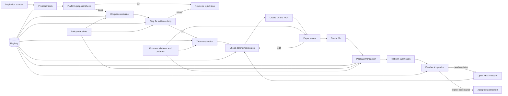
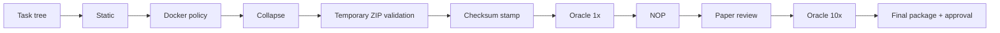

# Building a TERMINUS-Style Task Generation and Lifecycle Framework

**Audience:** a new maintainer starting from the public `Himu25/TERMINUS` repository and wanting a reliable framework for task ideation, generation, validation, packaging, submission, feedback, and continuous improvement.

**Baseline:** <https://github.com/Himu25/TERMINUS>

**Audit date:** 2026-07-23

**Already cloning Sudhir's Terminus-Pro repository?** Start with
`docs/CLONER-START-HERE.md`. It explains contributor versus independent-fork
mode, safe portfolio separation, and the mandatory pre-proposal conflict
screen. This document remains the architecture and implementation reference.

---

## 1. Purpose

The initial TERMINUS repository already contains a strong **task-authoring engine**:

- idea-generation prompts;
- task skeletons;
- a Step 2a validation loop;
- static, Docker, collapse, integrity, and ZIP checks;
- oracle and NOP integration through Harbor;
- review and approval tooling;
- regression fixtures and historical task archives.

What it does not provide as one coherent subsystem is a complete **stateful lifecycle control plane**. A mature framework must also answer:

1. Which ideas have been considered, rejected, reserved, or approved?
2. Which platform proposal check belongs to each idea?
3. Was uniqueness actually researched across every required corpus?
4. Which exact task tree was validated?
5. Which gate evidence became stale after an edit?
6. Which ZIP is the current submission and which ZIPs are historical references?
7. What did the platform report, and was that only an evaluation signal or final acceptance?
8. Which recurring failure has been converted into a preventive rule?
9. Can another maintainer resume the work without reconstructing history from chat?

This document explains how to add that control plane without replacing the useful baseline harness.

---

## 2. First principle: extend the baseline; do not rewrite it

Treat the upstream repository as four existing assets:

| Baseline asset | Main paths | Keep or replace? |
| --- | --- | --- |
| Authoring guidance | `AGENTS.md`, `.cursor/rules/`, `workflow.md`, `commands.md`, `REPO_CONVENTIONS.md` | Keep, then reduce contradictions and route all detailed policy to one owner. |
| Idea and specification engine | `web/`, `validate_loop.py`, `lint_spec.py`, and workflow references to `specs/validation_schema.json` | Keep the loop and lint. Verify that the referenced schema files exist in the pinned baseline; add or restore them before using Step 2a if absent. |
| Mechanical validation engine | `run_static_checks.py`, `dockerfile_check.py`, `collapse_check.py`, `instruction_audit.py`, `task_integrity.py` | Keep. Add structured results, policy ownership, and state/evidence integration. |
| Shipping and diagnostics | `scripts/check-task.sh`, `validate_submission_zip.py`, `approve_task.py`, `verifier_health.py`, `quality_check_adjudicate.py` | Keep. Make one package transaction own ZIP creation, validation, parity, and index refresh. |

Do **not** begin by building a web dashboard, database service, or autonomous idea generator. First make the command-line lifecycle correct, deterministic, recoverable, and testable. A UI can be a read-only view later.

---

## 3. Baseline audit before making changes

### 3.1 Pin the upstream revision

Never build against an unrecorded floating `main` branch. After cloning, record:

```bash
git clone https://github.com/Himu25/TERMINUS.git
cd TERMINUS
git rev-parse HEAD
git remote -v
git status --short
```

Create an `UPSTREAM_BASELINE.md` or an ADR containing:

- repository URL;
- commit SHA;
- clone date;
- Python, Harbor, Docker, and Docker Compose versions;
- baseline test results;
- known failing tests;
- local patch policy.

The GitHub page showed commit `b04b0da` during the 2026-07-23 audit, while an existing local remote-tracking branch may point to an older commit. The recorded SHA, not a README statement or branch name, is the trustworthy baseline.

### 3.2 Confirm license and redistribution rights

A public repository is not automatically permission to redistribute modified code or bundled task archives. Before giving the resulting framework to another person:

1. locate and read the repository license;
2. inspect licenses for copied task code and third-party assets;
3. inspect any embedded skill or humanizer license separately;
4. avoid republishing historical task archives unless permission is clear;
5. preserve required notices.

If no license is present, obtain permission or use the repository only as an architectural reference and implement the new control plane independently.

### 3.3 Record the baseline test state

The initial repository may not yet contain a locked Python project. Use `AGENT SETUP MANIFEST.txt` as the starting dependency inventory, then add a locked local environment before changing behavior.

Capture separately:

- repository unit/regression tests;
- static results for fixture tasks;
- ZIP validation over historical archives;
- Docker availability;
- Harbor availability;
- intentionally skipped tests;
- failures caused by missing infrastructure rather than code.

Never call a baseline “green” by excluding unexplained failures.

The audited public baseline referenced `specs/validation_schema.json` from its
workflow, but the locally pinned upstream tree did not contain a top-level
`specs/` directory. Treat documentation-to-file mismatches like this as real
bootstrap defects. Record them, restore the missing contract with tests, and do
not claim Step 2a works merely because `validate_loop.py` exists.

### 3.4 Normalize documentation names

The public README and the checked-in tree may refer to different workflow filenames, such as `workflow-prompts.md` versus `workflow.md`. Pick one canonical name, update references, and add a link or compatibility stub if external users may still use the old name. Do not allow two editable workflow documents.

---

## 4. Target architecture

The mature framework has two major planes:

1. **Authoring/data plane:** task source, Docker environment, oracle solution, verifier, and task metadata.
2. **Lifecycle/control plane:** ideas, states, policies, evidence, revisions, generated status views, and shipping transactions.



### 4.1 The control plane owns state, not task truth

The registry records what happened and where evidence lives. It must not duplicate task contents, expected answers, or verifier logic. Task truth remains in the task tree and its tests.

### 4.2 The authoring harness remains independently runnable

A contributor should still be able to run the baseline checks against a task directory. The lifecycle driver composes existing tools; it should not hide or fork their behavior.

---

## 5. Recommended directory layout

Use configurable neutral paths rather than hard-coding a maintainer’s name. The layout below can be adapted to the current `sudhir_*` reference implementation.

```text
TERMINUS/
├── control_config.toml
├── control_cli.py
├── root_adapter.py
├── task_layout.py
├── idea_proposal.py
├── eligibility_policy.py
├── model_policy.py
├── ci_policy.py
├── dossier.py
├── state/
│   ├── registry.json
│   ├── BOARD.md
│   ├── STATUS.md
│   └── CURRENT_SUBMISSION_INDEX.json
├── work/
│   ├── ideas/
│   │   ├── records/
│   │   ├── proposals/
│   │   └── specs/
│   ├── tasks/
│   │   ├── active/
│   │   └── archived/
│   └── submissions/
├── reviews/
│   └── <task-slug>/REV-<n>/
├── decisions/
│   ├── INDEX.md
│   └── ADR-xxxx-*.md
├── research/
├── knowledge/
│   ├── COMMON_MISTAKES.md
│   ├── WHAT_WORKED.md
│   ├── KNOWLEDGE_GRAPH.md
│   └── TASK_LIFECYCLE.md
├── logs/
├── plans/
├── platform/
│   ├── inbox/
│   └── archive/
├── tasks/                       # upstream compatibility/read corpus
├── specs/                       # upstream schemas/read corpus
├── Task_Ready_To_Submit/        # historical/read-only ZIP corpus
├── skeleton/
├── repo_tests/
└── scripts/
```

### 5.1 Mapping to the current reference implementation

| Neutral role | Current reference path |
| --- | --- |
| Registry | `sudhir_progress/registry.json` |
| Generated board | `sudhir_progress/BOARD.md` |
| Generated status summary | `sudhir_progress/STATUS.md` |
| Idea index | `sudhir_ideas/IDEA_INDEX.md` |
| Active task root | `sudhir_tasks/active/` |
| Canonical spec root | `sudhir_ideas/specs/` |
| Current submission root | `sudhir_tasks_ready_to_submit/` |
| Per-revision dossiers | `sudhir_reviews/<slug>/REV-<n>/` |
| Platform export inbox | `sudhir_snorkel/inbox/` |
| Lifecycle CLI | `sudhir_task.py` |
| Root configuration | `sudhir_config.toml` |

The neutral layout is preferable for a new public framework. If exact compatibility with the current reference is required, keep the `sudhir_*` names but ensure all paths are still loaded through configuration.

---

## 6. Source-of-truth rules

A framework becomes unreliable when several files can independently claim the same state. Define ownership before writing code.

| Information | Sole mutable owner | Derived views or evidence |
| --- | --- | --- |
| Idea and task status | `state/registry.json` | BOARD, STATUS, idea index |
| Current task source | configured active task root | current ZIP manifest |
| Step 2a evidence | configured spec root | registry evidence references |
| Current upload archive | configured submission root | current submission index |
| Historical archive corpus | upstream historical root | historical regression index |
| Platform feedback | raw export plus sanitized revision dossier | registry summary |
| Durable policy decision | accepted ADR or reviewed policy snapshot | executable constants/checks |
| Repeated failure lesson | common-mistakes ledger | preventive test/check |
| Final acceptance | explicit platform/reviewer evidence | board status |

### 6.1 Never infer acceptance

The following do **not** mean accepted:

- static checks passed;
- oracle passed;
- NOP failed correctly;
- difficulty was rated hard;
- all agents failed;
- evaluation passed;
- submission entered review.

Only an explicit platform or reviewer state of `accepted`/`approved`, with evidence, may set final acceptance.

### 6.2 Never create retrospective evidence

Imported historical work may honestly say:

- proposal check: `not-recorded`;
- uniqueness: `not-recorded`;
- Step 2a: `not-recorded`;
- idea status: `legacy` or `grandfathered`.

Do not fabricate old uniqueness research or validation evidence to make the board look complete.

---

## 7. Canonical root adapter

Implement the root adapter before adding lifecycle commands. Every producer must use it.

### 7.1 Configuration

Example:

```toml
version = 1

tasks_dir = "work/tasks/active"
specs_dir = "work/ideas/specs"
submissions_dir = "work/submissions"
reviews_dir = "reviews"
jobs_dir = "logs/jobs"
```

Allow environment overrides:

```text
TB3_TASKS_DIR
TB3_SPECS_DIR
TB3_SUBMISSIONS_DIR
TB3_REVIEWS_DIR
TB3_JOBS_DIR
TB3_VALIDATION_SCHEMA
```

### 7.2 Root object

The root object should expose:

- `task_dir(slug)`;
- `submission_zip(slug)`;
- canonical specs, reviews, jobs, and generated-view paths;
- historical task/spec/submission roots;
- current and historical submission indexes;
- `assert_writable(path)`;
- `ensure_canonical_dirs()`;
- `environment()` for subprocesses.

### 7.3 Write protection

`assert_writable()` must reject any path equal to or nested under a historical root. Resolve symlinks and `..` segments before comparison.

Also validate slugs before joining paths:

```text
^[a-z0-9][a-z0-9-]{2,63}$
```

After joining, resolve the candidate and verify it remains inside the expected canonical root. This closes path-traversal mistakes that a simple string join does not catch.

### 7.4 Migration sequence

Do not mark old roots read-only immediately. Use this order:

1. inventory every read and write caller;
2. classify each caller as canonical write, historical read, or fixture-only;
3. migrate all writers to the adapter;
4. run old/new path parity checks;
5. add write-rejection tests;
6. enable historical read-only enforcement;
7. retain an explicit, tested rollback mapping for one release;
8. remove the rollback only after stable operation.

Never maintain two mutable copies of a task.

---

## 8. Registry design

A JSON registry is sufficient for one maintainer and a repository-local workflow. Use SQLite if multiple hosts or many concurrent writers will modify state.

### 8.1 Registry top level

```json
{
  "schema_version": 3,
  "ideas": {},
  "tasks": {}
}
```

Use slug-keyed maps for direct lookup. Give each idea a permanent human-visible ID such as `IDEA-0001`.

### 8.2 Idea record

Minimum recommended shape:

```json
{
  "id": "IDEA-0001",
  "slug": "example-task",
  "title": "Example Task",
  "summary": "Two to five sentences.",
  "category": "scientific-computing",
  "languages": ["c", "rust"],
  "subcategories": [],
  "status": "captured",
  "portfolio_scope": "active",
  "task_slug": null,
  "proposal_check": {
    "status": "pending",
    "summary": "",
    "category_label": "",
    "category_slug": "",
    "associated_skills": [],
    "task_tags": [],
    "checked_at": null,
    "evidence": [],
    "feedback": "",
    "inspiration": {
      "source_type": "",
      "source_reference": "",
      "reuse_boundary": ""
    }
  },
  "uniqueness": {
    "status": "pending",
    "checked_at": null,
    "scope": [],
    "evidence": [],
    "fingerprint": {
      "domain": "",
      "mechanism": "",
      "topology": "",
      "verification": ""
    },
    "closest_analogue": "",
    "differentiator": ""
  },
  "validation": {
    "status": "not-started",
    "attempt": 0,
    "evidence": [],
    "reason": ""
  },
  "policy_snapshot_id": "policy-YYYY-MM-DD",
  "in_flight_exemptions": [],
  "eligibility_verdict": {},
  "next_action": "Run the proposal check.",
  "created": "ISO-8601 UTC",
  "updated": "ISO-8601 UTC",
  "history": []
}
```

### 8.3 Task record

```json
{
  "slug": "example-task",
  "idea_slug": "example-task",
  "title": "Example Task",
  "category": "scientific-computing",
  "languages": ["c", "rust"],
  "phase": "construct",
  "revision": 1,
  "source_dir": "work/tasks/active/example-task",
  "gates": {},
  "evidence": {},
  "package": {},
  "snorkel": {},
  "platform_status": {},
  "revisions": [],
  "learning": {
    "cm_hits": [],
    "patterns_applied": [],
    "form_refs": {}
  },
  "policy_snapshot_id": "policy-YYYY-MM-DD",
  "in_flight_exemptions": [],
  "eligibility_verdict": {},
  "next_action": "Run cheap gates.",
  "created": "ISO-8601 UTC",
  "updated": "ISO-8601 UTC",
  "notes": []
}
```

### 8.4 Independent state dimensions

Do not collapse the following into one `status` field:

1. proposal status;
2. idea gate status;
3. uniqueness status;
4. Step 2a validation status;
5. execution phase;
6. package/submission status;
7. platform outcome;
8. eligibility status.

They answer different questions and can legitimately differ.

### 8.5 Atomic transactions

For every CLI mutation:

1. acquire an exclusive repository-scoped lock;
2. load and migrate the registry schema in memory;
3. validate the requested transition;
4. perform related filesystem transaction steps;
5. write a temporary registry file;
6. flush and atomically replace the old registry;
7. regenerate all derived views from the same in-memory snapshot;
8. release the lock.

On Linux, `fcntl.flock()` is adequate for local processes. For portability, use SQLite transactions or a cross-platform lock library.

Atomic replace is necessary but not sufficient. If package/index/view generation can fail after a file has been replaced, keep a backup and restore it on failure.

### 8.6 Schema migration

Add a migration function for each registry version. Never silently overwrite unknown fields. A safe migration:

- adds defaults;
- preserves existing values;
- records the old schema version;
- validates the result;
- writes only after validation succeeds.

---

## 9. Generated views

Generate three views together:

1. detailed board;
2. concise current status;
3. idea portfolio/index.

Each view should contain:

- generation timestamp;
- digest of the registry snapshot;
- warning that it is generated;
- independent proposal, idea, uniqueness, execution, submission, platform, and eligibility columns;
- explicit next action.

Write all views as one transaction. If replacing the third file fails, restore the first two. A shared digest makes accidental hand edits detectable.

The generated views must never become alternate state stores.

---

## 10. Lifecycle state machine

Use this ordered task phase list:

```text
idea -> step2a -> construct -> gates -> review -> package -> submitted -> feedback
```

Platform outcome is separate and may be:

```text
not-submitted
pending
in-evaluation
in-review
evaluation-passed
needs-revision
accepted
rejected
```

### 10.1 Transition requirements

| Transition | Required evidence |
| --- | --- |
| candidate -> proposal passed | four valid proposal fields plus platform check evidence |
| proposal passed -> uniqueness passed | all required search scopes, fingerprint, evidence, closest analogue, structural difference |
| uniqueness passed -> Step 2a GO | valid Step 2a evidence and current eligibility |
| Step 2a GO -> task registration | linked approved idea and canonical source path |
| construct -> gates | complete task layout |
| gates -> review | cheap gates pass/WARN-adjudicated, oracle 1x = 1.0, NOP = 0.0 |
| review -> package | no unresolved review failure, no edits after evidence |
| package -> submitted | validated and approved current ZIP |
| submitted -> feedback | platform export or explicit status evidence |
| feedback -> accepted | explicit acceptance evidence only |
| feedback -> revision | a new revision dossier; prior gate/package evidence invalidated |

### 10.2 Dirty-flag rule

Compute a manifest of task files after Step 2b preflight. If any tracked file changes:

- static evidence is stale;
- collapse evidence is stale;
- oracle/NOP evidence is stale;
- review conclusions may be stale;
- package approval is stale.

Do not manually edit or delete the checksum to bypass this. Rerun the preflight and downstream gates.

---

## 11. Idea proposal gate

Before the first formal output, perform a lightweight local conflict screen
against active, rejected, retired, legacy, and quarantined ideas/tasks plus the
clone-origin collision snapshot. Compare domain, failure mechanism, distributed
fix topology, and verifier/invariant surface. This screen may reject or rework
an obvious collision, but it is **not** the formal six-scope uniqueness dossier
and must never be recorded as uniqueness PASS. Use
`sudhir_templates/PREPROPOSAL_CONFLICT_SCREEN_TEMPLATE.md`.

After the candidate passes that screen, the first formal output is exactly:

1. **Task Idea Summary:** 2–5 sentences;
2. **Idea Category:** one exact platform display label;
3. **Associated Skills:** 5–10 values;
4. **Task Tags:** 3–6 values.

Then stop and let the maintainer run the platform’s proposal check.

### 11.1 Local validation

The proposal helper should validate:

- sentence count;
- category label or normalized category slug;
- skills count;
- tags count;
- no empty list entries;
- evidence for passed/failed results;
- feedback text for a failed result;
- inspiration source type, reference, and reuse boundary.

### 11.2 Why this gate is early

It prevents spending hours on uniqueness research and task construction for a category or framing the platform rejects immediately. It does not replace uniqueness, eligibility, Step 2a, difficulty calibration, or final acceptance.

### 11.3 Provenance and no-copy boundary

Every proposal should record:

- what source inspired the idea;
- what abstract pattern was reused;
- what issue text, patch, tests, answer, or benchmark instance was **not** copied.

Sources are leads, not task content.

---

## 12. Uniqueness gate

A title change, language change, fixture change, or domain rename is not uniqueness.

### 12.1 Required search scopes

Require exact coverage of:

1. idea registry;
2. active tasks;
3. archived tasks;
4. submission archives;
5. upstream corpus;
6. external research.

### 12.2 Novelty fingerprint

Record at least:

- domain/system;
- failure mechanism;
- distributed fix topology;
- verifier/invariant surface.

For a stronger version, also record:

- language/runtime shape;
- structural archetype;
- causal investigation shape.

### 12.3 Evidence standard

A uniqueness PASS requires:

- dated search evidence;
- the closest analogue, preferably the closest three;
- structural differences, not adjectives;
- an explanation of why the graded object and causal discovery path differ;
- a record that remains searchable after rejection or retirement.

Rejected ideas keep their slugs and fingerprints so they are not unknowingly recycled.

---

## 13. Step 2a evidence loop

Reuse the baseline `validate_loop.py` rather than replacing it. Extend the evidence contract in a versioned, backward-readable way.

### 13.1 State machine

The loop should support:

```text
init -> record attempt -> CONTINUE | SELECT | GO | STOP -> finalize
```

Keep these outputs machine-readable:

```text
ACTION: GO
SAVE_TO: <authoring-spec-path>
REVIEWER_SAVE_TO: <reviewer-appendix-path>
REASON: <short reason>
```

### 13.2 Authoring and reviewer separation

Produce two files:

- authoring spec: safe to use during task construction;
- reviewer appendix: hidden discoveries, collapse analysis, flipping-point expectations, and review-only details.

Construction reads only the authoring spec until the task exists. This reduces accidental solution leakage.

### 13.3 Long-horizon investigation profile

For new ideas, require:

- 2–4 reinforcing weakness areas around one incident;
- a 4–8 stage causal chain;
- at least three heterogeneous evidence surfaces;
- at least two competing hypotheses with deterministic falsifiers;
- one failing scenario and a nearby healthy control;
- a 20–100 meaningful-action estimate;
- deterministic offline reproduction;
- domain reasoning that is not trivia.

The action estimate is authoring metadata, never a reward criterion. Tests grade outcomes, not command history, planning order, or tool choice.

### 13.4 Construction manifest

A mature Step 2a schema should pre-commit:

- at least three solver discoveries;
- at least three coordinated fix locations;
- no test concentration above the chosen cap;
- opaque fix-path symbols;
- a flipping-point contract mapping locations to test subsets;
- decoy/rhyming modules where needed;
- a noun/token audit preventing obvious grep-to-fix leakage.

Mechanical schema success is necessary but not sufficient. A human reviewer must still ask whether one location can absorb the others or whether a causal stage can be skipped.

---

## 14. Task layout abstraction

Do not duplicate layout logic across static checks, ZIP validation, requirements checks, approval, and shell scripts. Create one `task_layout.py` classifier.

### 14.1 Required output

Return a structured report:

```text
kind: standard | milestone | legacy-milestone | invalid
errors: []
warnings: []
milestone_names: []
```

Expose path helpers for:

- instructions;
- test directories and runners;
- verifier files;
- solution entrypoints and implementations.

### 14.2 Standard layout

```text
<task>/
├── instruction.md
├── task.toml
├── output_contract.toml
├── environment/
│   ├── Dockerfile
│   ├── .dockerignore
│   └── ...
├── solution/
│   └── solve.sh
└── tests/
    ├── test.sh
    └── test_outputs.py
```

### 14.3 Milestone layout

Support the current platform layout in the classifier even if house policy blocks net-new milestone tasks. Structural validity and eligibility are separate questions.

```text
<task>/
├── task.toml
├── environment/
└── steps/
    ├── milestone_1/
    │   ├── instruction.md
    │   ├── solution/{solve.sh,solve1.sh}
    │   └── tests/{test.sh,test_m1.py}
    └── milestone_2/
        └── ...
```

A structurally valid in-flight revision may be exempt even when new milestone starts are blocked.

---

## 15. Construction contract

The task builder must create a realistic existing system, not a blank algorithm exercise.

### 15.1 Required properties

- offline and deterministic;
- single-container unless explicitly supported;
- immutable digest-pinned base images;
- dependencies installed at image-build time;
- required `.dockerignore`;
- no tests or solution copied into the image;
- symptoms-only public instruction;
- domain-correct behavioral tests;
- deterministic oracle;
- NOP baseline rejected;
- no answer-shaped artifacts on solver-visible surfaces;
- no AI-scaffolding files in the submission archive.

### 15.2 `output_contract.toml`

Keep it as authoring metadata. It should distinguish:

- user-visible outputs;
- structured outputs and schema homes;
- internal harness files.

The instruction must cover user-visible obligations but must not leak internal harness paths. Exclude the file from the final submission ZIP if platform policy does not allow it.

### 15.3 Verifier safety

For pytest verifiers running from an agent-writable working directory, harden module resolution. A robust runner pattern changes into the verifier directory, uses safe-path behavior, and confines pytest configuration discovery to the verifier root.

Also write reward `0` before running tests so an interrupted verifier cannot leave the reward undefined. Keep the final reward footer aligned with current platform semantics.

---

## 16. Gate architecture

Use cheapest-first ordering. Expensive runs must never discover a failure a millisecond check could have caught.



### 16.1 Standard result envelope

Every gate should emit or return:

```json
{
  "check_id": "static.edition-2",
  "owner": "official|house",
  "result": "PASS|WARN|FAIL",
  "exit_code": 0,
  "command": "...",
  "checked_at": "ISO-8601 UTC",
  "task_tree_sha256": "...",
  "evidence_ref": "...",
  "details": {}
}
```

This prevents a result from being reused against a different task tree.

### 16.2 Static checks

Reuse `run_static_checks.py` and keep checks independently selectable. At minimum validate:

- required files;
- `task.toml` schema and allowed metadata;
- task layout;
- verifier runner semantics;
- Dockerfile references;
- absolute in-container paths;
- output contract;
- hidden instruction patterns;
- canary/legacy residue policy;
- package hygiene;
- timeout coherence;
- Python verifier lint and safe execution;
- instruction/test vocabulary coverage.

### 16.3 Docker checks

Reuse and extend `dockerfile_check.py` for:

- digest pinning;
- sanctioned final images or reviewed exemption;
- build-context limits;
- `.dockerignore`;
- dependency pinning and lock files;
- apt hygiene;
- reproducible downloads and checksums;
- no reserved mounts or unsafe capabilities;
- no runtime network installation;
- no tests/solution in the image;
- layer volatility warnings;
- no unnecessary build tools in final runtime;
- archive extraction/removal hygiene.

Keep official and house policy ownership separate.

### 16.4 Collapse checks

Preserve the baseline root causes:

| ID | Question |
| --- | --- |
| RC1 | Does the oracle mostly delete/revert code instead of adding real logic? |
| RC2 | Do visible names or paths reveal the repair target? |
| RC3 | Are tests shallow format/existence checks rather than domain behavior? |
| RC4 | Can the solver modify the source of expected values? |
| RC5 | Are answer-shaped references visible? |
| RC6 | Does the instruction reveal causes, algorithms, thresholds, locations, or a recipe? |
| RC7 | Is the genuine oracle too small/trivial? |

WARN must require documented residual-hardness justification. FAIL blocks.

### 16.5 Integrity sentinel

One preflight command must own checksum creation. Later commands only verify it.

Avoid an orchestration inconsistency where a `gates` command tries to verify a sentinel that no earlier step has written. Recommended contract:

```text
preflight = static + Docker + collapse + temporary ZIP + checksum write
approval  = checksum verify + gate recheck + final ZIP validation + parity
```

### 16.6 Oracle and NOP

- Step 2b: oracle exactly once; expected mean `1.0`.
- Step 2b: NOP exactly once; expected mean `0.0`.
- Final step only: oracle 10 times; all ten must pass.

Do not run the 10x stress test before all edits and paper review are settled.

### 16.7 Optional diagnostics

Keep these opt-in for revisions or specific suspicion:

- verifier randomized-order checks;
- partial-oracle ablations;
- repeated-oracle diagnostics;
- LLM quality-check adjudication.

If run, their reports become approval inputs. A diagnostic should not silently become an always-on expense.

---

## 17. Paper review layer

Mechanical checks cannot decide everything. Review:

1. instruction honesty and completeness;
2. environment realism;
3. oracle substance;
4. verifier fairness and alternate valid implementations;
5. metadata accuracy;
6. structural compliance;
7. residual difficulty after every public behavior is stated;
8. per-test chain dependency, order sensitivity, flakiness, and niche-technique risk.

For each edit, predict which earlier gates are at risk. Any task-file edit fires the dirty flag and returns to preflight, oracle 1x, and NOP.

Paper review produces no final acceptance verdict. Final local approval belongs to the package transaction after current mechanical evidence exists.

---

## 18. Revision dossier

Each revision gets an immutable numbered directory:

```text
reviews/<slug>/REV-1/
├── NOTES.md
├── FEEDBACK.md
├── PLATFORM.md
├── EVIDENCE.md
├── PREUPLOAD.md
├── DIFFICULTY.md
├── SOLUTION.md
├── VERIFICATION.md
├── RUBRIC.md
└── DSV-HUMANIZER-AUDIT.json    # only if that policy is adopted
```

Keep a task-level `EDIT_LEDGER.md` outside individual revisions.

### 18.1 Opening a revision

The `revise` transaction must:

1. increment the revision number;
2. create the dossier without overwriting older revisions;
3. append the edit ledger;
4. clear gate evidence;
5. clear package evidence;
6. remove or quarantine the stale current ZIP;
7. atomically refresh the current submission index;
8. move the phase back to construction or gates;
9. set one explicit next action.

### 18.2 Form capture

Store every UI paste durably. Difficulty, Solution, and Verification should be captured atomically as one set because they describe the same finished task.

A style/humanization layer is optional. If used:

- pin its version and license;
- restrict it to the three prose fields;
- never run it over task instructions, rubrics, code, tests, schemas, configuration, commands, identifiers, or evidence;
- make platform requirements, task truth, and project rules higher priority than style;
- write a content-hash audit;
- invalidate the audit after any field edit.

### 18.3 Pre-upload checklist

The checklist should require:

- current static/Docker/collapse evidence;
- oracle 1x and NOP evidence;
- oracle 10x evidence at final packaging;
- review complete;
- form fields stored;
- rubric stored and validated;
- common-mistakes prevention review;
- ZIP validation and parity;
- delegated upstream checks acknowledged.

Avoid an unaudited `--force` bypass. If emergency bypass is necessary, require a waiver record with reason, operator, timestamp, and affected checks. Never permit bypass of checksum parity, ZIP safety, or explicit acceptance evidence.

---

## 19. Packaging transaction

Packaging must be one recoverable transaction, not a sequence of loosely related shell commands.

### 19.1 Inputs

- canonical task directory;
- current task-tree checksum;
- complete revision dossier/pre-upload evidence;
- eligibility verdict;
- optional diagnostic reports.

### 19.2 Transaction

1. build a candidate ZIP in the canonical submission directory;
2. exclude caches, generated state, authoring-only files, review files, rubrics, checksums, and AI scaffolding;
3. validate archive paths and root shape;
4. compare source and ZIP manifests using the documented exclusion policy;
5. run the approval gate;
6. compute ZIP SHA-256 and member count;
7. atomically replace the prior current ZIP;
8. atomically refresh the current submission index;
9. update registry package evidence;
10. roll back ZIP and index if any step fails.

### 19.3 ZIP validator security

Reject:

- a wrapping top-level folder;
- absolute paths;
- `..` traversal;
- symlinks if unsupported;
- duplicate normalized paths;
- required-file omissions;
- forbidden authoring files;
- AI-scaffolding filenames at any depth;
- unexpected root layouts;
- root-level task state/checksum files.

Include `environment/.dockerignore` even though generic dotfile rules may exclude other dotfiles.

### 19.4 Separate current and historical indexes

Maintain:

- a generated index for current canonical submission ZIPs;
- an immutable fixture/index for historical archive regression.

Never refresh the historical index as a side effect of packaging current work.

---

## 20. Platform feedback ingestion

Assume exports are untrusted input.

### 20.1 Inbox workflow

```text
platform/inbox/*.json -> parse -> sanitize -> registry summary
                        -> REV-n/PLATFORM.md
                        -> platform/archive/*.json
```

Keep raw export provenance:

- source filename;
- SHA-256;
- submission ID;
- task ID;
- upload timestamp;
- ingestion timestamp.

### 20.2 Idempotence

Ingesting the same export twice must not:

- create another revision;
- duplicate notes;
- change the original ingestion time;
- overwrite manually captured feedback;
- infer acceptance.

Use submission ID + source filename + source hash as an idempotency key.

### 20.3 Sanitization

Do not store credentials, cookies, signed object URLs, or huge raw logs in Markdown. Clip large text blocks and retain a hash/reference to the raw export.

### 20.4 Status inference

It is acceptable to infer operational states such as `needs-revision` from a failed static result or non-hard difficulty. Label the source as `inferred`. Only explicit evidence may set accepted or rejected.

---

## 21. Policy engine

Policy changes over time. Hard-coded prose copied into many files will drift.

### 21.1 Separate policy classes

Render two verdicts:

- **official/platform compatibility**;
- **house excellence policy**.

A house rule must not be presented as an official rule.

### 21.2 Reviewed snapshots

A policy snapshot should include:

- ID and effective date;
- source URLs and retrieval date;
- content hashes or source references;
- category and structure restrictions;
- current model identifiers;
- official CI coverage dispositions;
- allowed exemptions;
- unresolved questions.

Automatic tools may detect source changes, but a human must review and promote semantic policy changes.

### 21.3 Eligibility

Evaluate eligibility at:

- uniqueness PASS;
- Step 2a GO;
- task registration;
- package;
- submit/update.

Support evidence-backed in-flight exemptions. An exemption should contain:

```json
{
  "id": "example-rule-exemption",
  "rule_id": "official.category.example.blocked",
  "effective_date": "YYYY-MM-DD",
  "recorded_at": "ISO-8601 UTC",
  "source": "platform command or page",
  "platform_state": "NEEDS_REVISION",
  "evidence": ["reviews/example/REV-2/ELIGIBILITY.md"],
  "reason": "Task was already in review before the block.",
  "status": "active"
}
```

A Boolean `grandfathered=true` is not enough.

### 21.4 Model policy

Keep current run targets separate from legacy artifact parsing. Unknown future model identifiers must remain visible as unknown, not disappear from reports.

### 21.5 Official CI coverage matrix

For every official check, assign one disposition:

- locally enforced;
- delegated upstream;
- mandatory human review;
- house override;
- not applicable with rationale.

Never fabricate a local PASS for an unpublished semantic limit. Surface it as delegated and require the upstream result before submission.

---

## 22. Learning system

The framework should improve after every rejection or surprising local failure.

### 22.1 Common mistakes ledger

Each entry contains:

- stable ID;
- active/prevented status;
- where it was seen;
- symptom;
- root cause;
- prevention;
- enforcing check or ADR when automated.

Never delete old entries. Mark them prevented when a regression test and gate close the hole.

### 22.2 What worked ledger

Record reusable positive patterns with evidence, for example:

- outcome-based assertions;
- exact flipping-point ablations;
- a second valid implementation during review;
- safe pytest invocation;
- normative schema documents for graded JSON keys;
- canonical root adapters and transactional status views.

### 22.3 Knowledge graph

Use lightweight Markdown nodes and edges if useful:

```text
FAILURE-CM-007 --prevented_by--> CHECK-PYTEST-SAFE-PATH
PATTERN-ABLATION --supports--> GATE-DISTRIBUTED-TOPOLOGY
POLICY-SNAPSHOT-2026-07-21 --governs--> ELIGIBILITY-CHECK
```

Do not build a graph database until the Markdown graph is demonstrably insufficient.

### 22.4 Promotion rule

When a failure repeats:

1. record it;
2. reproduce it with a fixture;
3. add the cheapest reliable prevention;
4. add a regression test;
5. update the ledger and knowledge graph;
6. run shadow checks across representative tasks;
7. promote from warning to blocking only after false positives are understood.

---

## 23. CLI contract

A neutral CLI can mirror the current `sudhir_task.py` commands:

```text
control_cli.py idea new
control_cli.py idea proposal
control_cli.py idea status
control_cli.py idea uniqueness
control_cli.py idea validation
control_cli.py idea list
control_cli.py idea quarantine
control_cli.py idea validate

control_cli.py new
control_cli.py status
control_cli.py board
control_cli.py phase
control_cli.py revise
control_cli.py gates
control_cli.py package
control_cli.py evidence
control_cli.py feedback-capture
control_cli.py form-capture
control_cli.py rubric-capture
control_cli.py learn-check
control_cli.py ingest
control_cli.py outcome
control_cli.py eligibility
control_cli.py exemption-capture
control_cli.py backfill
```

### 23.1 Exit-code contract

Use consistently:

- `0`: success/PASS;
- `1`: blocking domain or gate failure;
- `2`: invalid input or WARN-only result, depending on the command family.

It is cleaner to reserve `2` for WARN in checkers and use argparse’s standard usage error behavior for malformed CLI input. Document any exception.

### 23.2 Structured output

Add `--json` to read-only and gate commands. Human output is useful, but automation should not parse prose.

### 23.3 Subprocess safety

- pass argument lists, not shell strings;
- set the working directory explicitly;
- pass canonical root environment variables;
- capture stdout/stderr;
- preserve the actual exit code;
- add timeouts;
- never print secrets.

---

## 24. Day-to-day operating procedure

### Start of each work session

1. regenerate the board;
2. ingest platform exports;
3. read current status and next actions;
4. read common mistakes and what worked;
5. read the active plan, relevant ADRs, idea record, research, and revision dossier;
6. record intended work and baseline state.

### New idea

1. select one candidate;
2. produce four proposal fields;
3. stop for platform check;
4. capture the result and provenance;
5. run eligibility;
6. complete uniqueness dossier;
7. run Step 2a;
8. register task only after GO.

### Construction

1. create the task under the canonical root;
2. use the appropriate skeleton;
3. preserve the authoring spec;
4. run preflight;
5. run oracle 1x and NOP;
6. record job evidence;
7. perform paper review;
8. return to preflight after any edit.

### Final shipping

1. verify checksum;
2. run oracle 10x;
3. capture DSV and rubric fields;
4. complete pre-upload checklist;
5. package transaction;
6. validate current submission index;
7. upload;
8. mark submitted with evidence;
9. ingest feedback;
10. set accepted only from explicit acceptance.

### End of session

1. update registry transitions;
2. validate idea/task links;
3. regenerate board/status/index;
4. append changelog;
5. update ADRs and knowledge only when durable facts changed;
6. record new failure lessons immediately;
7. leave one explicit next action.

---

## 25. Regression-test strategy

The control plane must be developed test-first. Do not rely only on real tasks.

### 25.1 Unit tests

Add focused tests for:

- root resolution and environment overrides;
- historical write rejection;
- slug validation and path containment;
- registry migrations;
- locking and atomic writes;
- state-transition guards;
- proposal field validation;
- uniqueness requirements;
- eligibility and exemptions;
- model identification;
- platform export parsing and idempotence;
- dossier creation;
- ZIP exclusions and traversal rejection;
- package rollback;
- generated-view digest parity.

### 25.2 Fixture tasks

Maintain small synthetic fixtures for:

- valid standard task;
- each missing required file;
- valid current milestone layout;
- legacy milestone layout;
- invalid mixed layout;
- UI revision compatibility if supported;
- unsafe Dockerfile patterns;
- shallow verifier;
- tamperable gold values;
- answer-shaped artifacts;
- over-specific instruction;
- trivial oracle;
- stale checksum;
- forbidden ZIP files;
- wrapping folder and traversal entries.

### 25.3 Integration tests

Exercise full transactions in temporary roots:

1. idea capture -> proposal -> uniqueness -> Step 2a GO;
2. task registration -> preflight -> checksum;
3. package -> index refresh;
4. package failure -> ZIP/index rollback;
5. revise -> stale package removal and evidence invalidation;
6. feedback ingest twice -> no duplication;
7. explicit acceptance -> accepted;
8. evaluation pass -> not accepted.

### 25.4 Shadow rollout

Before making a new check blocking:

- run it over all active canonical tasks;
- run representative historical archives;
- include at least two runtime/language families for Docker checks;
- classify each delta;
- fix false positives or document waivers;
- record rollback behavior;
- then promote.

### 25.5 CI tiers

Recommended CI:

| Tier | Trigger | Contents |
| --- | --- | --- |
| Fast | every commit | Ruff, unit tests, schema tests, generated-view drift |
| Fixture | every pull request | static/collapse/ZIP/approval fixtures |
| Docker | labeled PR or nightly | representative image builds and offline verifier checks |
| Harbor | manual/nightly | oracle/NOP integration; no secrets on untrusted PRs |
| Archive | scheduled | historical ZIP validation and index parity |

---

## 26. Implementation roadmap

The order matters. Later layers depend on earlier ownership and safety.

### Phase 0: baseline and governance

Deliverables:

- pinned upstream SHA;
- license review;
- baseline test report;
- first ADR defining source-of-truth and official/house separation;
- clean branch for framework work.

Exit criteria:

- every baseline failure is explained;
- no task data is modified;
- repository can be restored to the pinned baseline.

### Phase 1: locked toolchain

Add:

- `.python-version`;
- `pyproject.toml`;
- lock file;
- `.gitattributes` for LF normalization;
- reproducible commands for tests and Ruff.

Keep the root harness lightweight. Prefer standard-library code except for schema validation and test tooling.

Exit criteria:

- a clean machine can reproduce the same environment;
- the full repository test command is documented.

### Phase 2: canonical roots and layout

Add:

- configuration file;
- root adapter;
- task layout classifier;
- path migration inventory;
- read-only historical roots after migration;
- current/historical index split.

Exit criteria:

- all writers use canonical paths;
- historical write attempts fail in tests;
- standard and supported milestone fixtures have one layout verdict everywhere.

### Phase 3: registry and generated views

Add:

- registry schema and migrations;
- locked atomic transactions;
- board/status/idea-index rendering;
- basic `new`, `status`, `board`, `phase`, and `backfill` commands.

Exit criteria:

- views share one digest;
- concurrent local mutations do not lose data;
- historical imports are represented honestly.

### Phase 4: proposal, uniqueness, and eligibility

Add:

- proposal helper and durable proposal files;
- six-scope uniqueness gate;
- policy snapshot and dual verdict;
- evidence-backed exemptions;
- idea/task link validator.

Exit criteria:

- construction is mechanically blocked until proposal PASS, uniqueness PASS, eligibility, and Step 2a GO.

### Phase 5: Step 2a integration

Extend:

- evidence schema version;
- long-horizon profile;
- authoring/reviewer split;
- construction manifest;
- spec lint;
- registry evidence links.

Exit criteria:

- legacy states remain readable;
- new loops cannot GO without the new profile;
- task files are not created on STOP.

### Phase 6: gate orchestration and integrity

Integrate:

- static checks;
- Docker checks;
- collapse checks;
- temporary ZIP validation;
- checksum write/verify;
- structured gate records;
- oracle/NOP evidence capture.

Exit criteria:

- one preflight writes the sentinel;
- any tracked edit makes approval fail until revalidated;
- oracle and NOP evidence references the current tree.

### Phase 7: dossier and learning loop

Add:

- revision workspaces;
- edit ledger;
- form/rubric capture;
- pre-upload checklist;
- common mistakes and what worked;
- optional DSV audit.

Exit criteria:

- opening a revision invalidates stale evidence and preserves old evidence;
- package is blocked on required current dossier content.

### Phase 8: transactional packaging

Add:

- candidate ZIP;
- ZIP safety checks;
- source/ZIP parity;
- approval composition;
- current submission index;
- rollback.

Exit criteria:

- failure at any packaging step leaves the prior current ZIP and index intact;
- historical archives never change.

### Phase 9: feedback ingestion

Add:

- inbox/archive workflow;
- export parser;
- sanitized platform snapshots;
- idempotency;
- explicit outcome command.

Exit criteria:

- evaluation cannot become acceptance by inference;
- repeated ingestion is a no-op;
- needs-revision creates or updates the correct dossier.

### Phase 10: policy sync and predictive quality

Add only after the core is stable:

- reviewed policy source cache and diff;
- official CI coverage matrix;
- current/legacy model profile;
- contract-to-test coverage artifact;
- rubric grammar gate;
- per-test union solvability reports;
- uniqueness similarity assistance;
- read-only dashboard if needed.

Exit criteria:

- policy changes are detected automatically but promoted only after review;
- every official check has an explicit disposition;
- new checks complete shadow rollout before blocking.

---

## 27. Minimal viable version versus mature version

### Minimal viable control plane

Build this first:

- root adapter;
- registry;
- board;
- proposal gate;
- uniqueness gate;
- Step 2a links;
- preflight/checksum;
- revision dossier;
- package transaction;
- feedback ingest;
- tests.

This is enough to prevent most lost-state and stale-evidence failures.

### Mature version

Add later:

- policy source hashing and impact simulation;
- dual official/house verdict reports;
- model-versioned trial analysis;
- per-test solvability aggregation;
- contract/test bidirectional coverage;
- rubric validator;
- knowledge graph;
- metrics;
- web dashboard.

Do not delay the minimal lifecycle waiting for predictive automation.

---

## 28. Common implementation mistakes

1. **Duplicating status in Markdown and JSON.** Markdown must be generated.
2. **Writing new tasks into historical `tasks/`.** Use one canonical active root.
3. **Letting a CLI command bypass prerequisites.** Enforce transitions centrally.
4. **Running 10x oracle too early.** Any later edit wastes the result.
5. **Treating WARN as PASS without justification.** Persist adjudication.
6. **Inferring acceptance from evaluation.** Require explicit evidence.
7. **Copying policy prose into many files.** Use versioned policy modules/snapshots.
8. **Making fetched policy automatically blocking.** Detect automatically; promote manually.
9. **Using one status field for idea, package, and platform.** Keep independent dimensions.
10. **Silently migrating old records.** Preserve `not-recorded` and legacy states.
11. **Refreshing a historical index during current packaging.** Keep indexes separate.
12. **Verifying a checksum before any command owns writing it.** Define a single preflight owner.
13. **Allowing a force flag to erase evidence requirements.** Use explicit waivers, not silent bypass.
14. **Hard-coding a personal namespace.** Make all roots configurable.
15. **Building a UI before transaction safety.** CLI and tests come first.
16. **Storing secrets or signed URLs in review logs.** Sanitize all platform data.
17. **Assuming public means licensed.** Verify redistribution rights.
18. **Copying historical tasks into a new public framework.** Ship code and synthetic fixtures, not private or answer-bearing task corpora.

---

## 29. Definition of done

The framework is ready for another maintainer when all of the following are true:

### Repository and setup

- [ ] Upstream commit and license review are recorded.
- [ ] Python and developer dependencies are locked.
- [ ] Setup and test commands work on a clean machine.

### State and roots

- [ ] One registry owns idea/task status.
- [ ] Generated views share one registry digest.
- [ ] Canonical roots are configurable.
- [ ] Historical roots reject production writes.
- [ ] Current and historical ZIP indexes are separate.

### Idea lifecycle

- [ ] Proposal PASS is required before uniqueness.
- [ ] Uniqueness requires all scopes, fingerprint, analogue, difference, and evidence.
- [ ] Step 2a GO is required before construction.
- [ ] Eligibility is checked at all decision boundaries.

### Task lifecycle

- [ ] One layout classifier is used everywhere.
- [ ] Preflight owns checksum creation.
- [ ] Edits invalidate evidence mechanically.
- [ ] Oracle 1x and NOP are recorded before review.
- [ ] Oracle 10x runs only at final packaging.

### Shipping

- [ ] Packaging is transactional and rollback-safe.
- [ ] ZIP traversal, wrapping, forbidden files, and parity are checked.
- [ ] Approval is tied to the current task-tree digest.
- [ ] Historical archives are never modified by package/revise.

### Feedback and learning

- [ ] Platform ingestion is sanitized and idempotent.
- [ ] Acceptance requires explicit evidence.
- [ ] Revisions have immutable numbered dossiers.
- [ ] Repeated failures enter a common-mistakes ledger and regression tests.
- [ ] Every session ends with one explicit next action.

### Tests

- [ ] Unit, fixture, integration, rollback, and generated-view tests pass.
- [ ] New checks complete shadow rollout before becoming blocking.
- [ ] No test depends on private credentials or live network access.

---

## 30. Practical recommendation

For a new maintainer, the safest approach is:

1. fork and pin the initial repository;
2. keep its task-authoring and validation engine;
3. add a neutral configurable namespace and root adapter;
4. add the registry and lifecycle CLI;
5. integrate proposal, uniqueness, eligibility, and Step 2a gates;
6. make checksum, package, and index updates transactional;
7. add revision dossiers and platform ingestion;
8. only then add policy synchronization, metrics, and UI.

The framework’s real value is not generating more task ideas. Its value is making every claim—unique, valid, hard, solvable, packaged, submitted, revised, or accepted—traceable to current evidence and impossible to confuse with a stale or inferred state.

---

## Appendix A: baseline components to reuse

| Component | Baseline path | Role in the new framework |
| --- | --- | --- |
| Task ideation bundle | `web/` | Candidate generation and refinement before proposal check |
| Workflow | `workflow.md` | Human process; update to reference the lifecycle CLI |
| Command reference | `commands.md` | Low-level tool commands; keep separate from state transitions |
| Step 2a loop | `validate_loop.py` | Evidence state machine; verify its referenced schema exists in the pinned baseline |
| Spec lint | `lint_spec.py` | Authoring/reviewer spec contract |
| Static checks | `run_static_checks.py` | Fast structural and policy checks |
| Docker checks | `dockerfile_check.py` | Image and build-context policy |
| Collapse checks | `collapse_check.py` | Anti-triviality and discoverability checks |
| Instruction audit | `instruction_audit.py` | Symptoms-only analysis |
| Integrity | `task_integrity.py` | Dirty-flag manifest |
| Preflight | `scripts/check-task.sh` | Static/collapse/temp-ZIP/checksum composition |
| ZIP validator | `validate_submission_zip.py` | Shipping archive safety and shape |
| Approval | `approve_task.py` | Authoritative local approval composition |
| Verifier diagnostics | `verifier_health.py` | Optional order/ablation/repeat checks |
| Quality adjudication | `quality_check_adjudicate.py` | Optional LLM-check finding classification |
| Skeletons | `skeleton/` | Known task layouts and offline verifier setup |
| Regression suite | `repo_tests/` | Harness behavior and fixture expectations |
| Historical archives | `Task_Ready_To_Submit/` | Read-only regression/uniqueness corpus, subject to licensing |

## Appendix B: control-plane components to add

| Component | Current reference | Recommended responsibility |
| --- | --- | --- |
| Root adapter | `root_adapter.py` | Canonical/historical roots and write safety |
| Lifecycle CLI | `sudhir_task.py` | All state transitions and generated views |
| Root config | `sudhir_config.toml` | Configurable canonical paths |
| Step 2a schema | `specs/validation_schema.json` | Versioned evidence contract when absent from the public baseline |
| Proposal contract | `idea_proposal.py` | Four-field validation and durable proposal rendering |
| Eligibility | `eligibility_policy.py` | Official/house dual verdict and exemptions |
| Model profile | `model_policy.py` | Current run targets and legacy parsing |
| CI profile | `ci_policy.py` | Official check coverage dispositions |
| Task layouts | `task_layout.py` | One structural classifier and path API |
| Dossier | `sudhir_dossier.py` | REV-n evidence and form capture |
| DSV audit | `dsv_humanizer.py` | Optional scoped prose validation and hash audit |
| Submission index builder | `scripts/build_submission_index.py` | Atomic current/historical index generation |
| Lifecycle skill | `.agents/skills/sudhir-task-lifecycle/` | Agent-facing workflow entry point |
| Knowledge system | `sudhir_knowledge/` | Lifecycle, mistakes, wins, graph, philosophy |
| ADRs | `sudhir_decisions/` | Durable decision history |

## Appendix C: reference implementation cautions

The current reference implementation is valuable but should not be copied blindly:

1. rename or parameterize personal `sudhir_*` paths for a general audience;
2. ensure the configured canonical spec root and immutable validation-schema root have distinct ownership;
3. make the preflight/checksum writer relationship explicit;
4. replace unaudited package force-bypass behavior with recorded waivers;
5. validate slugs and path containment centrally;
6. add subprocess timeouts and structured JSON outputs everywhere;
7. do not copy active tasks, review dossiers, platform exports, or registry data into a new distribution;
8. review all policy dates, model IDs, image digests, category blocks, and platform rules at deployment time rather than treating this document’s 2026 examples as permanent.
