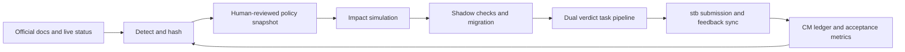
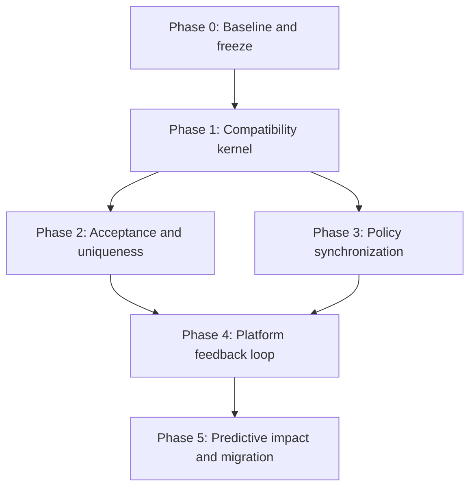

# Terminus EC policy sync and acceptance program

## Goal

Synchronize the TERMINUS framework with the current Terminus EC contract, then add a predictive policy and feedback loop so new tasks are accurate, genuinely unique, empirically difficult, and locally proven against likely platform rejection modes before submission.

This plan responds to [the complete documentation audit](../../sudhir_research/TERMINUS-EC-DOCS-GAP-AUDIT-2026-07-21.md), CM-020 through CM-023, and the current red repository baseline.

## Success definition

A new task is not “ready” because one local script exits zero. It is ready only when five independent questions have evidence-backed answers:

1. **Policy eligibility:** Is the task allowed for a net-new submission under the current dated policy, or does it have a proven in-flight exemption?
2. **Accuracy:** Is every graded behavior publicly contracted, every public requirement graded, and every verifier assertion behavior-based and tamper-resistant?
3. **Uniqueness:** Is the domain/mechanism/topology/verifier fingerprint structurally different from the closest local, archived, submitted, upstream, and externally researched analogues?
4. **Difficulty and solvability:** Does the current reference-model pair show useful difficulty for legitimate reasons while every test remains solvable across agent trials?
5. **Shipping integrity:** Does the exact ZIP pass current official compatibility, stricter house policy, checksum/parity, rubric, form, and platform-state gates?

The framework will render two separate verdicts:

- **PLATFORM COMPATIBLE:** current official policy and published checks pass.
- **HOUSE EXCELLENCE:** the repository’s stricter training-value rules pass.

A house rule must never masquerade as an official requirement. Every failure must say which profile owns it.

## What “four steps ahead” means

The framework will not auto-interpret policy prose and immediately enforce guesses. It will run a controlled four-step loop:

1. **Detect:** Fetch source metadata and hashes for all 44 documentation pages plus live Category Status and Changelog. Produce a diff before any new idea GO or package operation.
2. **Normalize:** A human-reviewed, schema-validated policy snapshot resolves dated changes and contradictions into explicit facts: models, eligibility, layouts, checks, thresholds, exemptions, and statuses.
3. **Impact-simulate:** Replay the proposed snapshot against every active idea, task, gate record, ready ZIP, exemption, skeleton, and regression fixture. Classify impact without mutating task evidence.
4. **Shadow and migrate:** Run changed checks in shadow mode, adjudicate false positives, then migrate only affected tasks. Any task-file edit invalidates checksum/gate evidence and follows the normal revision lifecycle.

Post-submission feedback closes the loop: rejection reasons are compared with local predictions, recorded in the CM ledger, and promoted into the cheapest reliable gate.

## Non-negotiable design decisions

1. **Fix wrong verdicts before adding architecture.** No policy engine is valuable while the current `test.sh`, milestone, UI, and model assumptions are wrong.
2. **Official facts and house policy remain separate.** They use separate versioned profiles and separate verdicts.
3. **Policy promotion is reviewed.** Fetching and diffing are automatic; semantic policy interpretation is not.
4. **No private platform API.** Platform synchronization wraps documented `stb` commands and stores provenance. Missing CLI capabilities remain explicit manual steps.
5. **No silent migration.** Policy changes never rewrite a task, archive, checksum, accepted evidence, or exemption automatically.
6. **Canonical writes stay canonical.** `sudhir_config.toml` defines writable roots. Legacy paths become clearly named, read-only historical/compatibility surfaces—not second writable copies.
7. **Accepted and submitted archives remain locked.** A policy change creates a new revision or an exemption record; it does not rewrite historical evidence.
8. **Manual judgment stays where semantics matter.** Creative uniqueness, rubric usefulness, long-context authority, non-canonical image justification, and fairness warnings require human review.
9. **No new task construction during compatibility-kernel repair.** Existing revision work may continue when its exemption and current platform status are recorded.
10. **Offline task policy remains a house rule unless superseded by a new ADR.** The framework must still understand that upstream permits justified internet use.
11. **Evaluation is never acceptance.** A registry transition to accepted requires an explicit source event whose state is `ACCEPTED`; no difficulty, solvability, static, review-pending, or evaluation-passed combination may infer it.

## Trigger and evidence

The program is triggered by verified findings, not speculative cleanup:

- official `rc=$?` / no-trailing-exit verifier footer fails locally while an obsolete trailing-exit footer passes;
- primary preflight uses deprecated milestone and UI verifier layouts;
- local calibration uses GPT-5.2 and Opus 4.6 instead of GPT-5.5 and Opus 4.8;
- blocked net-new categories and milestones are not mechanically exemption-aware;
- upstream CI has blocking checks missing locally;
- rubric grammar, long-context eligibility, and per-test union solvability are not mechanically validated;
- platform lifecycle sync is manual and incomplete;
- canonical and historical roots are independently writable;
- the repository regression suite currently has two failures.

## Program phases and dependency order

# Phase 0 — restore a trustworthy baseline

## Objective

Remove known repository ambiguity before changing policy behavior.

## Workstream 0.1 — accept an ADR before implementation

Create ADR-0016 to establish:

- official-vs-house dual verdicts;
- current-policy snapshot ownership and precedence;
- in-flight exemption semantics;
- write-root vs historical-corpus semantics;
- shadow-mode promotion for new checks;
- no silent evidence migration;
- explicit acceptance-transition evidence and the prohibition on inferring acceptance;
- generated `STATUS.md` as a registry view, not a second mutable status source.

The ADR must explicitly supersede stale external-policy claims without rewriting prior ADR history.

## Workstream 0.2 — restore regression green

- Reduce [AGENTS.md](../../AGENTS.md) below its existing 1,500-byte cap by demoting detail, not increasing the cap.
- Diagnose the extra `sparse-jacobian-color-contract.zip` in the legacy archive corpus before regenerating an index.
- Decide and document the intended archive roles, but do not enforce them until the adapter workstream below is complete:
  - `sudhir_tasks_ready_to_submit/` is the canonical writable current-submission root;
  - `Task_Ready_To_Submit/` is an immutable historical/reference corpus unless an explicit migration says otherwise.
- Split historical-corpus and current-submission indexes if both populations are needed. Do not point one index at two meanings.
- Generate `STATUS.md` from the registry in the same transaction as BOARD; it is a concise generated view, never hand-edited.

## Workstream 0.3 — design the root adapter before later enforcement

The current code still names `Task_Ready_To_Submit/` in approval, ZIP validation defaults/examples, submission indexing, requirements guidance, and regression tests. Root roles cannot change by documentation alone.

Phase 0 produces the migration inventory and design only. A later isolated slice implements it before historical read-only behavior can be enforced:

1. inventory every root lookup and classify it as canonical-write, historical-read, or fixture-only;
2. specify one shared resolver with separate canonical task/submission and historical task/submission accessors;
3. enumerate canonical package/approve commands and current-submission tests to repoint;
4. define the separate historical index and uniqueness/research reader;
5. define dual-write comparison for at most one revision only if parity cannot otherwise be proved;
6. define manifest/ZIP parity evidence required before disabling legacy writes;
7. define a rollback mapping that restores old defaults without deleting either population.

Immutability becomes active only after every write caller uses the canonical accessor and a regression test proves that writes through a historical accessor fail.

## Workstream 0.4 — establish a change baseline

Before implementation, record:

- full regression result;
- current static pass-message inventory;
- current six active task metadata and gate states;
- current canonical and historical archive manifests;
- current model IDs and policy source hashes;
- current generated board.

## Phase 0 exit criteria

- `python3 -m repo_tests` exits 0.
- AGENTS is under its existing cap.
- Historical and canonical roles are ADR-defined and independently indexed; the adapter inventory and rollback design are complete, while read-only enforcement waits for its isolated implementation slice.
- BOARD and generated STATUS cannot disagree by construction.
- ADR-0016 is accepted.

# Phase 1 — current official compatibility kernel

Phase 1 fixes incorrect local verdicts and adds only the minimum shared policy primitives. It does not yet build the full policy-diff system.

## Workstream 1.1 — semantic `test.sh` validation

### Change surface

- [run_static_checks.py](../../run_static_checks.py)
- [requirements_check.py](../../requirements_check.py)
- default and milestone skeleton test runners
- [repo_tests/test_run_static_checks.py](../../repo_tests/test_run_static_checks.py)
- focused official-snippet fixtures

### Required behavior

The checker must parse semantics rather than match literal casing/indentation:

- accept direct `$?` use or a variable captured immediately after pytest;
- require success reward `1` and failure reward `0`;
- require the reward block to be the canonical end of the script;
- reject every trailing exit after the reward block;
- accept the current documented invalid-WORKDIR guard after reward `0`;
- preserve CM-007 cwd-shadow hardening;
- preserve CM-016’s initial-zero protection only if it remains compatible with current platform CI; otherwise label it as house policy rather than changing official footer acceptance.

### Tests

At minimum:

- exact current official example passes;
- current official example with safe-path hardening passes;
- obsolete uppercase variable plus trailing exit fails;
- exit before reward fails;
- one reward branch missing fails;
- non-binary reward fails;
- runtime network install still fails;
- harmless formatting and variable-name variations pass;
- PWD guard `exit 0` passes;
- `set -e` still fails for non-UI pytest tasks.

## Workstream 1.2 — one canonical task-layout library

### Problem

Milestone logic is implemented differently in static checks, requirements checks, ZIP validation, skeletons, and shell preflight.

### Design

Extract one read-only task-layout classifier used by:

- `scripts/check-task.sh` through a Python preflight helper;
- `run_static_checks.py`;
- `requirements_check.py`;
- `validate_submission_zip.py`;
- `approve_task.py`;
- test/oracle discovery;
- packaging parity.

The classifier returns standard, current milestone, legacy milestone, or invalid, with structured evidence.

### Current milestone contract

- root `task.toml`, `environment/`, and `steps/`;
- sequential `steps/milestone_N/` directories;
- per-step instruction, pytest runner/file, solve wrapper/implementation;
- matching `[[steps]]` names/count;
- per-step agent/verifier timeout tables;
- no deprecated root instruction/tests/solution/milestone files.

### Policy behavior

- net-new milestones are blocked by eligibility, not by pretending the layout is invalid;
- exempt in-flight milestone revisions may pass structural validation;
- legacy layouts are reported as legacy and require explicit exemption/migration evidence;
- structural compatibility and net-new eligibility are separate checks.

### Tests

- a complete official milestone fixture passes full `scripts/check-task.sh`, not only ZIP validation;
- all missing per-step files fail individually;
- count/name/order mismatches fail;
- deprecated root files fail;
- one-milestone tasks fail the milestone contract;
- standard tasks are unaffected;
- legacy fixture reports the correct migration/exemption status.

## Workstream 1.3 — UI support decision

No active canonical task currently uses `ui_building`.

Adopt the smallest honest path:

- mark the local UI skeleton unsupported for new starts;
- remove it from scaffold selection or move it under an explicitly historical directory;
- reject net-new UI work as a house rule at idea validation, not with obsolete JS verifier requirements;
- if an in-flight UI revision appears, require the current official Python pytest + Playwright Python contract and add a focused compatibility fixture before accepting the work.

Do not maintain a misleading JavaScript/Vitest skeleton “just in case.”
ADR-0016 must state that an exempt UI revision cannot receive local approval until the pytest + Playwright Python compatibility fixture and matching checker branch exist; it must not be forced through the obsolete JS path.

## Workstream 1.4 — central current model profile

Create one small module or JSON profile consumed by:

- `agent_test.py`;
- `requirements_check.py`;
- quality-check commands;
- rubric review model defaults;
- workflow/commands generated references;
- artifact parsers.

The current pair is GPT-5.5 and Claude Opus 4.8, effective 2026-06-12. Historical IDs remain parseable but cannot satisfy a current calibration claim.

Artifact parsing must accept unknown future model IDs as `unknown-currentness`, preserve them in output, and refuse to silently discard trials.

## Workstream 1.5 — eligibility and in-flight exemption model

Extend registry ideas/tasks with:

- `policy_snapshot_id`;
- `first_submitted_at`;
- `first_submitted_evidence`;
- `in_flight_exemptions[]`, each with rule ID, effective date, source, evidence, recorded time, and optional expiry;
- `eligibility_verdict` with official and house components.

Pre-schema defaults are additive and non-destructive. Existing tasks remain readable as `policy_snapshot=pre-ADR-0016` and `eligibility=grandfathered-pending-review`. Missing new fields do not break ingest or board rendering; they block only the next package/submit decision when required evidence is still absent.

Eligibility is checked at:

- idea uniqueness PASS;
- Step 2a GO;
- task registration;
- package;
- submission/update.

Current net-new blocks:

- `data-processing`;
- `debugging`;
- `software-engineering`;
- milestone tasks.

`rowgroup-prune-mirage` must remain active as an exempt revision, with platform evidence—not a hand-created boolean alone.

## Workstream 1.6 — label official and house checks

Before a full registry refactor, add metadata to every top-level result:

- source: official or house;
- official check ID where one exists;
- effective date;
- severity;
- whether it blocks platform compatibility, house approval, or both.

This can initially be a static map keyed by existing check names. Do not rewrite all checkers yet.

## Phase 1 exit criteria

- exact current official `test.sh` fixtures receive correct verdicts;
- one official milestone fixture passes complete preflight and ZIP validation;
- obsolete JS UI verifier assumptions no longer define validity;
- every model command and parser uses the current centralized pair;
- a new blocked-category task fails before Step 2a construction;
- the exempt RPM revision passes eligibility with evidence;
- all results identify official vs house ownership;
- full regression remains green.

# Phase 2 — acceptance, accuracy, and uniqueness gates

Phase 2 closes the highest-probability platform rejection modes and makes uniqueness harder to fake.

## Workstream 2.1 — official CI parity matrix

Create a coverage map for every official check. Each row must be one of:

- locally enforced;
- delegated to upstream command and required before submission;
- mandatory human review;
- intentionally stricter house override;
- not applicable with rationale.

Implement or complete, in priority order:

1. sanctioned/canonical final base or credible documented exemption;
2. build context ≤100 MiB total and ≤50 MiB per file;
3. task-file size limits;
4. ecosystem dependency pins/locks for pip, npm, Cargo, Go, Maven, and Gradle;
5. unsafe capabilities including `NET_ADMIN`, `SYS_MODULE`, similar caps, and Docker socket;
6. all reserved mounts, including `/oracle` where applicable;
7. runtime network setup including `git clone`;
8. same-stage archive extraction/removal;
9. no build tools in final runtime unless the task requires them;
10. layer-volatility and reproducibility warnings;
11. typo check strategy or explicit delegation to platform if no reliable local equivalent exists.

New semantic/warning checks must use shadow mode before blocking.

Shadow evidence must match the check class:

- footer/syntax checks: all six active canonical tasks plus representative historical scripts;
- layout checks: standard and milestone fixtures plus every in-flight layout family;
- Docker checks: at least two distinct language/runtime families;
- model/difficulty changes: at least two agent-facing language stacks;
- eligibility checks: pre-block, post-block, exempt, and missing-evidence fixtures.

Exact P0 repairs may use an abbreviated shadow window only when ADR-0016 records the official source, read-only result diff, rollback, and false-positive adjudication.

## Workstream 2.2 — deterministic rubric grammar gate

Create a validator for `REV-N/RUBRIC.md`, not a rubric file inside the shipping task.

Mechanically validate:

- allowed criterion/header lines only;
- each criterion begins `Agent`;
- each score ends with explicit signed value in ±1/±2/±3/±5;
- no score 4 or unsigned positive;
- non-milestone flat-list form;
- milestone `# Rubric N` sequence and per-block rules;
- at least three negatives for a non-milestone task;
- at least one negative per milestone;
- positive total 10–40 per task or milestone;
- no references to tests, task metadata, instructions, oracle, NOP, packaging, or approval;
- no blank/generic criteria that are mechanically detectable.

Run it during `rubric-capture`, `form-capture`, `learn-check`, `package`, and pre-submission sync. Semantic rubric quality stays human-reviewed.

Grandfathering rule: capture commands validate every newly captured rubric immediately. `learn-check` and `package` enforce the validator for revisions captured after the validator takes effect, and for older revisions that are edited or re-captured afterward. Older untouched rubric evidence remains readable and is labeled legacy/unverified rather than silently failing.

## Workstream 2.3 — contract-to-test bidirectional coverage

Build a generated review artifact, not a self-authoring prompt:

- extract test names, asserted structured keys, exact opened output paths, invoked flags/env overrides, and public result states;
- compare against `instruction.md`, cited normative schemas, environment code stubs, and `output_contract.toml`;
- produce two lists:
  - tested obligations without a public contract home;
  - public requirements without a test candidate.

Exact missing paths/keys may block. Semantic mappings remain reviewer-adjudicated. This strengthens CM-002/006/018 without leaking oracle mechanisms into instructions.

## Workstream 2.4 — verifier fairness and anti-cheating

Add conservative signals:

- exact oracle/agent mode branching is blocking;
- latency/wall-clock assertions are warnings requiring adjudication;
- oracle-replication thresholds near 5% are warnings requiring adjudication;
- editable-input answer planting remains blocking through RC4;
- source-grep tests remain blocking;
- alternate valid implementation evidence remains mandatory during paper review for representation-sensitive tasks.

Preserve a dedicated CM-014 false-positive guard fixture: verifier-owned expected values and plain-string executable constants must not be classified as agent-editable gold merely because data paths use `Path` objects.

Do not turn semantic fairness warnings into automatic failures without false-positive evidence.

## Workstream 2.5 — long-context subtype gate

Mechanical portion:

- corpus has at least 50,000 tokens using a documented tokenizer or conservative count;
- corpus files are shipped and not generated at runtime;
- reject obvious logs/dumps/structured-record bulk when disallowed by the current checklist;
- identify whether the long corpus is actually referenced by the public task and tests.

Manual portion:

- the corpus is authoritative;
- the task requires semantic synthesis rather than keyword extraction;
- context is not decorative filler;
- a domain expert considers the material realistic.

## Workstream 2.6 — current-model difficulty and per-test union solvability

Extend trial aggregation to record:

- model ID and profile version;
- full-suite passes/trials/errors;
- per-test pass count across runs;
- tests that never pass;
- infrastructure vs legitimate failures;
- declared vs empirical difficulty;
- whether evidence uses the current model pair.

Calibration sequence for a stable task:

1. oracle 1x + NOP after mechanical gates;
2. one current-model smoke run per model to detect bad failures;
3. after repair settles, five sequential runs per current model for difficulty;
4. aggregate per-test union over those ten runs;
5. escalate to `-k 10` on each model when any test passes fewer than two of five runs, platform previously reported `solvable=false`, or confidence is otherwise low.

Do not run expensive agent batches before the cheap official/house gates pass.

## Workstream 2.7 — uniqueness 2.0

Preserve the existing six-scope uniqueness dossier and strengthen evidence quality.

### Mechanical requirements

- every new idea has a normalized fingerprint: domain, failure mechanism, distributed topology, verifier/invariant surface, language/runtime shape, and structural archetype;
- all six exact collision scopes have dated evidence;
- the closest three analogues are named, not only one;
- each analogue has a structural difference statement;
- lexical similarity is computed against idea records, active/archived tasks, historical submission instructions, and the upstream corpus available locally;
- rejected/retired idea fingerprints remain collision candidates;
- category/domain renaming alone never counts as uniqueness;
- exact fingerprint or archetype duplicates block before Step 2a.

### Human requirements

- judge whether the causal discovery path and graded object are genuinely different;
- reject template refills even when lexical similarity is low;
- confirm the verifier rewards the claimed novelty rather than generic final output;
- record uncertainty instead of fabricating uniqueness PASS.

### Portfolio control

The policy/profile schema records category, language, subtype, mechanism, and archetype data needed for later portfolio reporting. Dashboard rendering is deferred until Phase 3 so it cannot delay the acceptance firewall. Distribution warnings never override live category blocks.

## Phase 2 exit criteria

- every official requirement is mapped in the coverage matrix;
- all implemented official blocking checks have positive/negative fixtures;
- malformed rubric variants fail before package;
- contract/test coverage artifact catches CM-018-style missing keys and paths;
- per-test union aggregation handles “0 full-suite passes but every test passed once” correctly;
- a long-context fixture exercises both mechanical PASS and manual-review status;
- uniqueness PASS requires three analogues and six-scope evidence;
- no new task can reach construction with pending eligibility or uniqueness.

# Phase 3 — policy synchronization and dual verdict engine

## Workstream 3.1 — source lock and local cache

Add `sudhir_policy/` with:

- `sources.lock.json`: URL, title, source tier, retrieval time, content hash, last effective date;
- `official_policy.json`: current reviewed official facts;
- `house_policy.json`: current reviewed house rules and rationale;
- `history/<policy-id>.json`: immutable promoted snapshots;
- `requirements_coverage.json`: official rule-to-control mapping;
- `open_questions.md`: unresolved contradictions requiring human decision.

Full remote documentation bodies remain in a local ignored cache, not committed. The repository stores normalized facts, source links, and hashes.

Promoted snapshots remain directly available while referenced by any active task, package, exemption, or migration. Older unreferenced snapshots may move to a compressed historical archive; their IDs and hashes remain in the active index.

## Workstream 3.2 — policy sync command

Add a driver subcommand such as `sudhir_task.py policy sync` that:

1. fetches the known sources;
2. verifies all required sources are reachable;
3. computes hashes;
4. reports additions/removals/changes;
5. records a proposed snapshot;
6. refuses automatic promotion when content changed semantically or source precedence is unresolved.

A separate `policy promote` command requires an ADR/review note and writes immutable history.

## Workstream 3.3 — precedence resolver

Use this order unless ADR-0016 chooses otherwise:

1. live dated Category Status and Changelog;
2. latest dated Reviewer Checklist;
3. current Task Requirements, CI, LLMaJ, and topic pages;
4. detailed guides;
5. FAQ, examples, glossary, old videos.

Rules:

- latest effective date wins within the same authority tier;
- live block status wins over generic “no restrictions” text;
- executable platform behavior may prove a docs bug but must be recorded as observed evidence, not silently rewritten as policy;
- unresolved conflicts produce `policy-review-required`, not a guessed result.

## Workstream 3.4 — check registry and dual verdict

Each check registers:

- local ID;
- official ID/source URL or house rule ID;
- effective policy version;
- applicability predicate;
- severity;
- shadow/active state;
- false-positive budget;
- owning module;
- regression fixture IDs.

Gate, package, and board output show official and house verdicts separately. Package requires official PASS. House FAIL requires an explicit, ADR-backed override; routine task authoring should target both PASS.

## Workstream 3.5 — impact simulation

For a proposed policy snapshot, classify every tracked item:

- still green;
- evidence stale but task structurally valid;
- exempt in-flight;
- newly blocked net-new;
- newly allowed upstream but still house-blocked;
- migration required;
- unresolved policy question.

The simulator reads task metadata and evidence but never edits either.

## Workstream 3.6 — shadow promotion and rollback

A new or materially changed check cannot block immediately. Promotion requires:

- at least five shadow runs across at least two distinct real tasks;
- positive and negative regression fixtures;
- every false positive classified and added as a guard fixture;
- no unresolved effect on in-flight exemptions;
- documented rollback;
- policy and coverage manifests updated.

Critical exact checks may use a shorter shadow window only with ADR evidence.

“Distinct real tasks” is defined by the shadow matrix in Workstream 2.1. Five repetitions of one task/layout/language do not satisfy promotion.

## Phase 3 exit criteria

- cold-cache policy sync detects the current 46 sources and reproduces their hashes;
- a changed-source fixture produces a proposed diff, not an auto-promoted rule;
- all known audit contradictions resolve according to precedence tests;
- every active check appears in the check registry;
- every task receives two verdicts;
- impact simulation classifies RPM as exempt and a synthetic new data-processing task as blocked;
- rollback to the previous policy snapshot is tested.

# Phase 4 — platform feedback and submission operations

## Workstream 4.1 — documented `stb` adapter

Wrap documented CLI behavior for:

- project listing;
- submission listing/status;
- submission feedback/download/view references;
- create/update eligibility;
- reviews/adjudications if this repository uses those roles.

The adapter must:

- avoid logging credentials;
- preserve raw command output or JSON in the Snorkel inbox/archive with hashes;
- distinguish command failure, authentication failure, rate limit, infrastructure failure, and empty result;
- never downgrade explicit acceptance to an inferred evaluation state;
- support replay fixtures without credentials.

Register an explicit blocking check, `platform.acceptance_transition`: the registry may enter accepted only when the synchronized source event itself contains `ACCEPTED`. Fixtures must prove that HARD + solvable + static PASS, `EVALUATION_PENDING`, `REVIEW_PENDING`, and `OFFERED` cannot produce accepted.

## Workstream 4.2 — full platform state vocabulary

Track official states including:

- `EVALUATION_PENDING`;
- `NEEDS_REVISION`;
- `REVIEW_PENDING`;
- `ACCEPTED`;
- `OFFERED`;
- `REJECTED`;
- `SKIPPED`.

Keep local phase, submission readiness, evaluation result, reviewer outcome, and payment/offer state separate.

## Workstream 4.3 — submission capacity

Render:

- net-new submissions today in UTC;
- current limit based on accepted-task count;
- remaining capacity;
- revision queue count and limit;
- which submissions are updateable;
- stale platform sync warnings.

Revisions must never consume the net-new counter locally.

## Workstream 4.4 — pre-submission command

Add one high-level `submit-check` that does not upload. It requires:

- policy snapshot current;
- official eligibility PASS or evidenced exemption;
- uniqueness PASS;
- current checksum;
- official compatibility PASS;
- house excellence PASS or ADR override;
- oracle 10x and fresh NOP evidence;
- current-model calibration evidence or explicit risk decision;
- per-test union solvability evidence;
- LLMaJ current-model result/adjudication;
- rubric and form validation;
- ZIP validation/parity;
- platform capacity and updateability.

It emits `SUBMITTABLE` only from current evidence. Upload remains an explicit user operation or a separate command.

Freshness reuses the existing task-integrity checksum and the selective evidence-dependency map: any tracked task-file edit invalidates the dependent oracle, NOP, review, calibration, and package evidence. No parallel timestamp-only freshness mechanism is introduced.

## Workstream 4.5 — rejection prediction and learning

For each returned submission:

- parse every rejection/finding into a normalized reason code;
- compare with the last local pre-submission prediction;
- classify as caught-local, missed-local, false-positive-local, platform-infrastructure, or policy-change;
- append/update CM and knowledge-graph evidence;
- calculate rolling metrics by policy version and check ID.

## Phase 4 exit criteria

- real `stb submissions list` data syncs one known submission without secrets in logs;
- all official states round-trip through replay fixtures;
- board capacity values match platform output;
- submit-check refuses stale policy, invalid rubric, wrong ZIP, and full revision queue fixtures;
- acceptance is never inferred from evaluation-only fields;
- acceptance-transition fixtures require explicit `ACCEPTED` source evidence;
- missed rejection reason creates a traceable CM candidate.

# Phase 5 — predictive migration and continuous improvement

## Workstream 5.1 — migration plans

For each policy-affected task, generate a plan containing:

- policy delta;
- exemption decision;
- files/evidence affected;
- cheapest gate to rerun;
- whether Step 2a must reopen;
- whether task checksum/package is invalidated;
- expected platform/house verdict after migration;
- rollback instructions.

A human approves the plan before edits.

## Workstream 5.2 — selective evidence invalidation

Policy changes should invalidate only evidence that depends on the changed rule:

- model upgrade invalidates difficulty/solvability evidence, not ZIP parity;
- rubric grammar change invalidates rubric validation, not task checksum;
- layout change affects structure, static, checksum, ZIP, oracle/NOP, and review;
- category block affects eligibility, not the technical correctness of an exempt revision;
- base-image policy affects Docker/static/package evidence.

The dependency map is explicit and regression-tested.

## Workstream 5.3 — forward probes

Before policy promotion, run synthetic probes for likely future drift:

- unknown model ID;
- newly blocked/unblocked category;
- new optional manifest field;
- renamed CI check;
- changed reward footer whitespace/variable form;
- new platform status;
- docs source missing or contradictory;
- historical task exempt under a new block.

The goal is not guessing future policy. It is proving the framework fails safely and visibly when policy shape changes.

## Workstream 5.4 — quarterly house-policy review

Use acceptance data to review:

- hard-only rule;
- no Python-primary rule;
- offline-only rule;
- low-level multi-language preference;
- UI/multi-container blocks;
- oracle 10x policy;
- minimum environment-size rule.

A house rule remains only when recent evidence shows it improves acceptance or training value without encouraging padding or template repetition.

## Phase 5 exit criteria

- a synthetic model/category/layout policy change produces the correct impact report;
- migration plan and rollback are generated before any mutation;
- selective evidence invalidation tests pass;
- unknown policy shapes fail closed with a clear review-required state;
- house-policy review dates appear on the board.

# Change surface by repository component

| Component                                       | Planned responsibility                                                                                                                            |
| ----------------------------------------------- | ------------------------------------------------------------------------------------------------------------------------------------------------- |
| `sudhir_task.py`                                | Policy sync/promote/status, eligibility/exemptions, dual verdict display, submit-check, stb sync, capacity, evidence/version fields.              |
| `sudhir_config.toml` and a shared config module | Canonical writable roots, historical read-only roots, policy source configuration.                                                                |
| `run_static_checks.py`                          | Correct official footer/layout semantics, official CI checks, source metadata on results.                                                         |
| `requirements_check.py`                         | Full official requirement matrix and manual-review markers; no stale model/layout assumptions.                                                    |
| `dockerfile_check.py`                           | Canonical base, context sizes, capability breadth, ecosystem pin/lock and runtime-stage checks.                                                   |
| `collapse_check.py`                             | Preserve current anti-collapse checks; add only conservative fairness signals and policy metadata.                                                |
| `agent_test.py`                                 | Current model pair, future model tolerance, difficulty, failure quality, per-test union solvability.                                              |
| `validate_submission_zip.py`                    | Shared task-layout parser, canonical root shape, policy-aware metadata exclusions.                                                                |
| `approve_task.py`                               | Dual verdict, policy snapshot, evidence dependency verification, exact ZIP parity.                                                                |
| `sudhir_dossier.py`                             | Rubric/form validation status, policy/exemption references, normalized feedback reasons.                                                          |
| `scripts/check-task.sh`                         | Thin orchestrator only; no duplicate layout logic.                                                                                                |
| skeletons                                       | Current standard template; current milestone compatibility template retained only for exempt revisions; unsupported UI skeleton removed/archived. |
| `repo_tests/`                                   | Official snippets, policy precedence, dual verdict, impact, migration, adapter replay, false-positive guards.                                     |
| `sudhir_policy/`                                | Versioned reviewed policy facts, source locks, history, coverage, open questions.                                                                 |
| `sudhir_progress/`                              | Generated board/status/capacity/portfolio views only.                                                                                             |

# False-positive and overengineering controls

1. **Exact syntax rules may block immediately** only when the current official contract is unambiguous and fixtures reproduce it.
2. **Semantic heuristics begin as warnings** and require adjudication: long-context authority, latency, near-oracle thresholds, rubric usefulness, originality beyond structural collisions.
3. **No automatic NLP policy parser.** Detection is hash/diff; normalization is reviewed.
4. **No automatic semantic uniqueness verdict.** Similarity and fingerprints provide evidence; humans decide structural novelty.
5. **No automatic waiver.** Every waiver is typed, evidenced, scoped, and reviewed; temporary waivers expire.
6. **No blanket symlink migration.** Historical corpora and current canonical roots have different purposes and must be classified before path changes.
7. **No checker rewrite.** Existing mature checks are wrapped/tagged and repaired incrementally.
8. **No new always-on prose unless a mechanical or scoped control cannot work.** AGENTS byte cap remains binding.
9. **Every observed false positive becomes a regression fixture.** Repeated false positives demote the check to warning until repaired.
10. **Every policy promotion has rollback.** Previous snapshots and task evidence remain immutable.

# Effect on current tasks

## `rowgroup-prune-mirage`

- Keep as an active in-flight `data-processing` revision.
- Add dated exemption evidence from platform state and live policy source.
- Do not reopen uniqueness or redesign solely because the category later blocked.
- Re-run only evidence invalidated by current model/checker changes before a new claim.

## Other active revisions

- Model-based difficulty claims from GPT-5.2/Opus 4.6 become historical evidence.
- Technical task/package evidence remains valid unless a changed compatibility rule affects it.
- Any task edit continues to invalidate checksum/gate evidence under the existing lifecycle.

## Captured/reserved ideas

- Re-evaluate eligibility before uniqueness/Step 2a.
- New ideas in blocked categories remain visible but cannot enter construction.
- Existing fingerprints remain collision candidates even when blocked/rejected.

## Accepted tasks and locked archives

- Never rewrite.
- Use only as historical acceptance evidence, uniqueness corpus, and regression input.
- Policy impact reports may label their old evidence, but cannot mutate their accepted state.

# Verification matrix

## Required test families

1. Official `test.sh` good/bad snippets and false-positive variants.
2. Standard/current-milestone/legacy/invalid layout matrix across static, requirements, ZIP, approval, and shell preflight.
3. Current/historical/unknown model artifact parsing.
4. Category and milestone eligibility before/after block dates with real and missing exemption evidence.
5. Official-vs-house dual-verdict matrix.
6. Every official CI check: one PASS, one FAIL, one closest legitimate false-positive guard where relevant.
7. Rubric grammar matrix, including milestone blocks and forbidden references.
8. Bidirectional contract/test coverage for paths, keys, flags, env vars, states, and semantic-review fallback.
9. Per-test union solvability, including no full-suite pass but all tests individually pass.
10. Long-context mechanical pass/fail and semantic-review-required states.
11. Policy precedence contradictions from the audit.
12. Policy source missing/change/open-question behavior.
13. Impact classification and selective evidence invalidation.
14. `stb` adapter replay for every status and failure class.
15. Canonical write-root guards and historical read-only behavior.
16. Package/registry/board/status transaction consistency.

## Validation order for implementation batches

For each batch:

1. focused new tests;
2. directly affected existing tests;
3. full repository regression;
4. read-only run against all six active canonical tasks;
5. read-only validation of all canonical ready ZIPs;
6. compare check result deltas to the recorded baseline;
7. update CM status only after mechanical prevention is proven.

# Acceptance metrics and service levels

Track by official policy version and rolling submission window.

| Metric                                                                             |                     Initial target | Hard safety floor |
| ---------------------------------------------------------------------------------- | ---------------------------------: | ----------------: |
| Platform static/LLMaJ rejections caused by a requirement already known locally     |                0 in 10 submissions |          ≤1 in 10 |
| Current-policy sync lag                                                            |                          ≤48 hours |         ≤96 hours |
| New tasks carrying current policy snapshot                                         |                               100% |              100% |
| Net-new blocked task starts                                                        |                                  0 |                 0 |
| Exempt tasks misclassified as blocked                                              |                                  0 |                 0 |
| Official requirements with a coverage disposition                                  |                               100% |              100% |
| Active blocking checks with PASS/FAIL regression fixtures                          |                               100% |              100% |
| Active check false-positive rate                                                   |                                ≤2% |               ≤5% |
| Registry vs platform state older than 24 hours                                     | 0 tasks when credentials available |           ≤1 task |
| New ideas with six-scope evidence and three nearest analogues                      |                               100% |              100% |
| Submitted tasks with current-model difficulty evidence or documented risk decision |                               100% |              100% |
| Tests never passed in agent union sample                                           |                                  0 |                 0 |
| Repository regression                                                              |                         100% green |        100% green |

Acceptance rate alone is not sufficient: a trivially easy task may be accepted poorly or rejected after difficulty. Track rejection reason, empirical difficulty, solvability, and novelty separately.

# Program go/no-go rules

## Freeze conditions

Freeze new task construction or packaging when any is true:

- repository regression is red;
- current policy sources changed but are not reviewed/promoted;
- exact official compatibility probes disagree with local gates;
- model pair is stale or unknown;
- canonical write roots and package indexes disagree;
- a policy promotion has unresolved precedence conflicts;
- a silent checksum/evidence mutation is detected.

Existing platform revisions may continue only when the affected rule and exemption are known.

## Resume conditions

Resume new task construction when:

- Phase 1 compatibility kernel is green;
- current policy snapshot is active;
- eligibility and uniqueness are PASS;
- official and house gates identify their ownership;
- no P0 compatibility finding remains active without a pre-upload compensating control.

# Milestones and deliverables

## Milestone A — Trustworthy current framework

Deliverables:

- ADR-0016;
- green baseline;
- semantic verifier footer;
- shared current milestone layout;
- UI support clarified;
- current model pair centralized;
- eligibility/exemption fields and gates;
- result source labels.

## Milestone B — Acceptance and uniqueness firewall

Deliverables:

- official CI coverage matrix and parity checks;
- rubric grammar validator;
- contract/test coverage report;
- fairness signals;
- long-context gate;
- current-model difficulty + union solvability;
- uniqueness 2.0 and portfolio views.

## Milestone C — Policy drift control

Deliverables:

- source lock/cache;
- reviewed official and house profiles;
- sync/diff/promote/rollback;
- check registry and dual verdict;
- impact simulator and shadow promotion.

## Milestone D — Platform learning loop

Deliverables:

- `stb` adapter and full states;
- submission capacity view;
- submit-check;
- rejection prediction comparison;
- selective migration and evidence invalidation;
- rolling acceptance/false-positive metrics.

# Rollback

Rollback is phase-scoped:

- Phase 1 checker changes keep pre-change fixtures and can restore old behavior, but a rollback must reinstate the manual CM-020/021/022 pre-upload controls and freeze new packaging.
- Policy snapshots are append-only. Rollback reactivates a prior profile; it never deletes history.
- Registry schema additions are additive. Old entries remain readable with defaults.
- Platform adapter failure falls back to manual export ingestion without deleting raw synced evidence.
- Root-role migration keeps manifests and copies until parity is proven; no historical corpus is deleted in this program.
- Any task migration uses the normal revision mechanism and its own rollback note; accepted archives are never rollback targets.

# Verification checklist

- [x] ADR-0016 accepted.
- [x] Baseline regression green before compatibility changes.
- [x] Official verifier-footer probes produce correct local verdicts.
- [x] Current official milestone fixture passes complete preflight.
- [x] Net-new blocked category/milestone fixtures fail eligibility, not structure.
- [x] RPM exemption is evidence-backed and passes eligibility.
- [x] Current model pair is used everywhere; unknown model IDs remain visible.
- [ ] Every official check has a coverage disposition.
- [ ] Rubric grammar and form capture are mechanically blocked on invalid input.
- [ ] Contract/test report catches known CM-002/018 patterns.
- [ ] Per-test union solvability fixtures pass.
- [ ] Uniqueness requires six scopes and three nearest analogues.
- [ ] Official and house verdicts are independently tested.
- [ ] Policy precedence resolves every contradiction in the audit.
- [ ] Impact simulation is read-only and correctly classifies all fixture classes.
- [ ] `stb` adapter replay covers every official state.
- [ ] Canonical roots are the only writable task/submission roots.
- [ ] BOARD and STATUS are generated from registry.
- [x] Full regression green after every completed implementation slice.
- [ ] CM-020 through CM-023 marked prevented only after their enforcing tests pass.

# Immediate implementation slices

Do not start with the full policy engine or bundle independent verdict changes.

## Slice 1 — decision and baseline only

1. accept ADR-0016 with dual verdict, root roles, pre-schema defaults, acceptance-transition guard, generated STATUS, shadow policy, and rollback semantics;
2. reduce AGENTS below the existing cap by demotion;
3. diagnose the extra ZIP and restore correct historical/current indexes without reclassifying roots yet;
4. run the full suite to green.

No checker verdict, registry schema, task source, or root default changes in this slice.

## Slice 2 — semantic verifier footer only

1. add exact official and false-positive fixtures;
2. implement semantic footer validation;
3. run it report-only against all six active canonical tasks and representative historical scripts;
4. adjudicate every delta;
5. activate the verdict change with rollback documented;
6. run focused, affected, and full suites.

Nothing else changes in this slice.

## Slice 3 — current model profile only

1. centralize GPT-5.5/Opus 4.8 IDs and effective date;
2. keep historical and unknown model parsing visible;
3. replace stale command/reviewer references;
4. prove no task verdict changes solely from refactoring constants;
5. run full regression.

## Later isolated slices

4. registry eligibility/exemption schema, with the grandfathered defaults from Workstream 1.5;
5. shared milestone layout classifier, shadowed by layout family before activation;
6. UI scaffold deprecation, with the exempt-revision safeguard from Workstream 1.3;
7. root adapter migration and historical read-only enforcement;
8. official CI parity checks, one check family per slice.

During the freeze, net-new block behavior is proved with synthetic fixtures only; no real net-new task is started. Existing revisions continue under recorded policy/exemption evidence.

CM-020 through CM-023 are marked prevented only for failure modes whose mechanical prevention and regressions have actually landed.

## Slice 1 evidence — complete 2026-07-21

- [x] ADR-0016 accepted and indexed.
- [x] AGENTS reduced by demotion from 1,679 to 1,247 bytes; the 1,500-byte cap was not raised.
- [x] Extra sparse-Jacobian ZIP diagnosed: valid standard archive, 43 members, SHA-256 `dcc1c8f49a542b30aa8374e2589d1789da0a1f5cfc126533a2f9dee6db74ffa5`, byte-identical in historical and canonical roots.
- [x] Historical index updated from 158 to 159 archives without deleting or rewriting an archive.
- [x] Separate canonical-current index added for all six canonical archives and regression-covered.
- [x] Focused cap/index suite: 16 tests PASS.
- [x] Changed Python regression test: Ruff PASS.
- [x] Full repository regression: 285 tests PASS, 26 skipped.
- [x] No checker verdict, registry schema, task source, root default, skeleton, or submission archive changed.

Next implementation action is Slice 2 only: semantic verifier-footer fixtures, report-only shadow comparison, adjudication, then isolated activation.

## Slice 2 evidence — complete 2026-07-21

- [x] Added three accepted fixtures: current `rc=$?`, inline `$?`, and safely captured mixed-case/quoted status.
- [x] Added three rejected fixtures: trailing exit, intervening command that clobbers `$?`, and reversed binary rewards.
- [x] Replaced active literal matching with semantic status/reward validation while preserving the established static-check pass message.
- [x] Current documented WORKDIR `exit 0` is accepted; existing guard `exit 1` remains compatible.
- [x] Report-only shadow: 6/6 active canonical source scripts unchanged PASS; 6/6 canonical ZIP scripts unchanged PASS.
- [x] Historical shadow: 156 unchanged PASS, 5 literal-format false negatives corrected to PASS, 0 PASS-to-FAIL regressions, 0 semantic failures across 161 scripts.
- [x] Five historical deltas manually inspected. Their footer semantics are valid; separate pre-existing guard/reward concerns were not waived or changed in this footer-only slice.
- [x] Post-activation active-task check: all six canonical task sources PASS with zero footer failures/warnings.
- [x] Ruff PASS; focused footer/static suite 36 tests PASS; full repository regression 292 tests PASS, 26 skipped.
- [x] No registry schema, task source, skeleton, root default, or submission archive changed.

Next implementation action is Slice 3 only: centralize GPT-5.5/Opus 4.8 identifiers, keep historical/unknown models visible, replace stale references, and prove the refactor changes no task verdict.

## Slice 3 evidence — complete 2026-07-21

- [x] Added `model_policy.py` as the executable source for the current model pair, effective 2026-06-12.
- [x] New agent runs default only to GPT-5.5 (`@openai/gpt-5.5`) and Claude Opus 4.8 (`@anthropic/claude-opus-4-8`).
- [x] Current GPT quality-check flag is `openai/@openai/gpt-5.5`; advisory Anthropic SDK default is `claude-opus-4-8`.
- [x] GPT-5.2 and Opus 4.6 artifacts remain parseable as explicitly legacy evidence.
- [x] Model-shaped unknown future IDs remain visible in reports; oracle/NOP job keys are still excluded from frontier calibration.
- [x] Difficulty thresholds and classification code were unchanged; identical current/legacy pass rates produce identical verdicts.
- [x] Operational guidance and executable consumers contain no legacy model default. Historical reviews, audit evidence, and explicit previous-vs-current examples were preserved.
- [x] Dry-run generated exactly two current commands and made no API calls: GPT-5.5 and Opus 4.8.
- [x] Ruff PASS; focused model/agent/requirements suite 24 tests PASS, 6 skipped; full repository regression 299 tests PASS, 26 skipped.
- [x] No registry schema, task source, task verdict, skeleton, root default, or submission archive changed.

Next implementation action is isolated Slice 4: add the eligibility/exemption registry schema with pre-ADR defaults, prove blocked net-new cases only through fixtures during the freeze, and capture evidence-backed exemption handling without changing task source.

## Slice 4 evidence — complete 2026-07-21

- [x] Added reviewed eligibility snapshot `terminus-ec-2026-07-21` for the three current category blocks and the net-new milestone block.
- [x] Registry schema v3 adds `policy_snapshot_id`, `first_submitted_at`, `first_submitted_evidence`, `in_flight_exemptions`, `eligibility_verdict`, and `number_of_milestones` to ideas/tasks.
- [x] All pre-schema records migrated additively to `pre-ADR-0016`; 31 ideas and 12 tasks have zero missing policy fields.
- [x] Pre-ADR records remain readable and non-blocking during view/non-shipping work; missing evidence blocks their next package/submit decision when a current block applies.
- [x] Current net-new blocked categories fail before uniqueness PASS, Step 2a GO, task registration, package, and submitted phase. Net-new milestones fail through eligibility, not a false structural error.
- [x] Exemptions require rule ID, effective date, source, revision/review platform state, non-empty evidence references, reason, and active status; a bare boolean or empty evidence cannot exempt.
- [x] Added `eligibility` and `exemption-capture` commands plus an Eligibility board column. Board rendering is read-only and cannot overwrite action-specific verdicts.
- [x] RPM dossier evidence records submission `fac356b4-6394-4023-b296-30308827b30e` in `NEEDS_REVISION`; linked idea/task each carry the same evidence-backed exemption.
- [x] RPM package eligibility: official=`exempt-in-flight`, house=`exempt-in-flight`, blocking=false.
- [x] Canonical lifecycle, taxonomy, authoring rules, idea-generation prompts, and commands now name data-processing and net-new milestone blocks.
- [x] Ruff PASS; focused synthetic eligibility suite 14 tests PASS; full repository regression 314 tests PASS, 26 skipped; registry validation 0 errors.
- [x] No task source, checker layout, skeleton, root default, or submission archive content changed.

Next implementation action is isolated Slice 5: extract one canonical standard/current-milestone/legacy layout classifier, run it in report-only shadow by layout family, then migrate static/requirements/ZIP/preflight consumers without weakening the net-new milestone eligibility block.

## Slice 5 evidence — complete 2026-07-21

- [x] Added `task_layout.py` as the single neutral classifier for standard, current milestone, legacy milestone, and invalid inventories. It owns sequential step names, declared counts/names, canonical files, root conflicts, and standard versus per-step timeout placement.
- [x] Added source helpers for instruction, verifier, test-runner, test-directory, solution-entrypoint, solution-directory, and milestone implementation paths.
- [x] Report-only shadow before activation: 6/6 active sources valid standard; 6/6 then-current canonical ZIPs valid standard; 159/159 historical ZIPs valid (158 standard, one current milestone); zero classification regressions.
- [x] `validate_submission_zip.py` parses `task.toml` before layout selection, delegates to `classify_inventory`, preserves its report/pass-message API, and no longer contains a duplicate milestone classifier.
- [x] `run_static_checks.py` delegates structural discovery to the shared classifier, validates each current milestone instruction/test runner/verifier/solution in its step directory, reads per-step timeouts, and traverses all step-local semantic surfaces.
- [x] `requirements_check.py` delegates structure, verifier discovery, per-step timeout checks, and solution auditing to shared layout paths.
- [x] `scripts/check-task.sh` no longer rejects milestones through a root `instruction.md` shell guard. ZIP/preflight and instrumentation fixtures now carry the shared module explicitly.
- [x] `collapse_check.py` and `instruction_audit.py` aggregate milestone-local instructions, tests, solver-visible surfaces, and oracle entrypoints without exposing solution files to solver-visible analysis.
- [x] The current milestone skeleton's verifier scripts now use the canonical no-errexit binary reward footer, PWD guard, offline pytest hardening, and no trailing exit; step instructions use neutral wording and explicit completion signaling.
- [x] New consumer regression proves the milestone skeleton passes shared structure, static/preflight, requirements, and collapse-loader/oracle-source traversal.
- [x] Post-activation parity: all six active sources remain valid standard and have zero static failures; five current canonical ZIPs and all 159 historical ZIPs validate, including the historical milestone.
- [x] Canonical index reconciled to registry/root truth after RPM returned to feedback/needs-revision and an externally regenerated envelope archive changed fingerprint; no archive bytes were edited.
- [x] Ruff PASS; complete repository regression 311 tests PASS, 26 skipped.
- [x] Net-new milestone eligibility remains blocked by the Slice 4 policy gate; structural validity does not create eligibility.
- [x] No active task source, submission archive content, root default, or historical evidence was changed.

Next implementation action is isolated Slice 6: deprecate the stale UI scaffold and reconcile UI verifier support, with the recorded in-flight revision safeguard and the same report-only/shadow/activation discipline.

## Slice 6 evidence — complete 2026-07-21

- [x] Re-verified the current official Task Subtypes Markdown: `ui_building` remains recognized and UI verification must use Python pytest plus Playwright's Python bindings, not a JavaScript/TypeScript Playwright suite.
- [x] Accepted ADR-0017. Net-new UI is explicitly a repository **house** block; it is not misreported as an official platform block.
- [x] Eligibility records now persist `subcategories`; idea/task registration exposes `--subcategories`; source refresh reads the manifest before package eligibility.
- [x] Dual verdict serialization is genuinely profile-specific. A net-new UI record reports official=`eligible`, house=`blocked`; source-backed review/revision evidence yields official=`eligible`, house=`exempt-in-flight`.
- [x] UI house eligibility blocks uniqueness PASS, Step 2a GO, task registration, package, and submit through the existing driver flow.
- [x] Deleted all 15 files in the retired `skeleton/UI_Task_Skeleton/`; Git history preserves the obsolete generation, and no replacement scaffold invites new UI starts.
- [x] `run_static_checks.py` accepts the official in-flight compatibility shape: standard pytest `test.sh`, `tests/test_outputs.py` importing Playwright Python, pinned Python Playwright dependencies, and browser installation at image-build time.
- [x] Verifier-side package/Vitest/JS-or-TS Playwright files, npm verifier runners, `set -e`, and the separate UI reward footer no longer define validity and are rejected for UI compatibility.
- [x] Lifecycle, commands, architecture, task creation/review rules, workflow, conventions, web guidance, skeleton index, and consolidated specification now state the house block and Python compatibility safeguard.
- [x] Shadow inventory: 0/6 active tasks, 0/5 current canonical ZIPs, and 0/159 historical ZIPs use `ui_building`; none contain the retired JS/Vitest verifier pair.
- [x] Post-activation active-task parity: all six non-UI tasks retain zero static failures. Existing musl and SJCC timeout/discoverability warnings are unrelated and unchanged by UI policy.
- [x] Focused UI/eligibility/static suite: 60 tests PASS. Ruff PASS. Full repository regression: 320 tests PASS, 26 skipped.
- [x] CM-022 is mechanically prevented across its milestone and UI halves.
- [x] No active task source or submission archive content was edited. Both archive indexes were refreshed only for an externally regenerated SJCC archive present byte-identically in historical and canonical roots.

## Proposal-first lifecycle addendum — complete 2026-07-21

- [x] Captured the current Snorkel Task Idea Proposal form contract from user-provided screenshots: 2–5 sentence summary, one category, 5–10 skills, and 3–6 tags.
- [x] Accepted ADR-0018: proposal Check feedback is the first external gate for a selected candidate and must precede uniqueness, Step 2a, task registration, or file creation.
- [x] Added `idea_proposal.py` and `sudhir_task.py idea proposal` with field-count/category validation, PASSED/FAILED evidence, feedback capture, source provenance, reuse boundary, and durable proposal Markdown.
- [x] New idea records expose independent proposal status. Proposal PASS gates uniqueness and task registration; established historical work remains honestly `not-recorded`.
- [x] BOARD and IDEA_INDEX show the Proposal axis and proposal-specific next action before downstream work.
- [x] Added the tiered inspiration source ladder and wired it into both lifecycle skills, canonical lifecycle, workflow, standalone web bundle, seed generation, finalist refinement, commands, and the always-on AGENTS routing.
- [x] External issues, SWE-bench, papers, books, release notes, Stack Overflow, and Reddit are inspiration leads only; current eligibility, originality, source provenance, and no-copy boundaries remain mandatory.
- [x] AGENTS remains below its 1,500-byte cap at 1,353 bytes; lifecycle skill copies are byte-identical.
- [x] Focused proposal/idea/eligibility suite: 41 tests PASS. Ruff PASS. Full repository regression: 328 tests PASS, 26 skipped; registry validation: 0 errors.
- [x] Canonical archive index refreshed for the externally packaged RPM REV-4 ZIP already recorded in registry; no archive bytes were edited by this change.

Next implementation action remains isolated Slice 7: inventory every root reader/writer, implement the canonical-root adapter, enforce historical roots read-only only after parity and rollback tests, and generate current status views transactionally from the registry.

## Slice 7 evidence — complete 2026-07-21

- [x] Completed the reader/writer inventory in `sudhir_research/ROOT-ADAPTER-INVENTORY-2026-07-21.md`: canonical-write, canonical-read, historical-read, fixture-only, and prose surfaces are classified.
- [x] Accepted ADR-0019 and added `root_adapter.py` as the sole production resolver for configured roots plus `TB3_*` overrides.
- [x] Canonical writable roots are `sudhir_tasks/active`, `sudhir_ideas/specs`, `sudhir_tasks_ready_to_submit`, `sudhir_reviews`, and `sudhir_logs/jobs`. `tasks`, `specs`, and `Task_Ready_To_Submit` are compatibility/historical read surfaces; adapter writes raise `HistoricalRootWriteError`.
- [x] Added and tested `legacy_rollback_roots()`; rollback restores old defaults without deleting either population or changing archive bytes.
- [x] Migrated the pipeline driver, sourced shell environment, Step 2a writes, approval spec lookup, collapse manifest lookup, requirements command rendering, similarity readers, and current submission indexing to the adapter.
- [x] Current package writes are canonical-only. Package/index failure restores the previous ZIP; revision invalidation removes only the canonical ZIP and restores it if current-index refresh fails.
- [x] Current index moved to generated state at `sudhir_progress/CANONICAL_SUBMISSION_INDEX.json` and refreshes atomically during package/revise. Historical `repo_tests/fixtures/submission_index.json` remains a separate explicit 159-archive baseline.
- [x] Semantic index checks PASS independently: current 6/6 valid; historical 159/159 valid. Three overlapping names are byte-identical by SHA-256; no dual-write window or copying was required.
- [x] BOARD, IDEA_INDEX, and STATUS now render from one registry snapshot, carry one SHA-256 generation ID, and restore prior bytes when grouped replacement fails. STATUS is no longer hand-maintained.
- [x] Active command, workflow, task-creation, and review guidance contains no historical archive writer; canonical packaging uses `sudhir_task.py package` and `$TB3_*` paths.
- [x] Shadow parity: 6/6 active canonical task sources retain zero static failures; existing musl/SJCC warnings are unchanged and unrelated. Compatibility roots remain readable (177 task files, 7 spec/schema files) but are not production write targets.
- [x] Focused adapter/transaction suite: 11 tests PASS. Ruff PASS. Full repository regression: 339 tests PASS, 26 skipped; registry validation: 0 errors.
- [x] CM-023 is mechanically prevented. No active task source, historical archive, current archive, checksum, or platform outcome was rewritten by this migration.

Next implementation action is isolated Slice 8: build the official CI requirements coverage matrix, then implement one missing check family at a time with exact fixtures, shadow comparisons, false-positive adjudication, and rollback evidence.

## Slice 8 evidence — complete 2026-07-21

- [x] Accepted ADR-0020 and added `ci_policy.py` with reviewed source URL, exact 10-image sanctioned final-runtime list plus `scratch`, 100 MiB/50 MiB context limits, unsafe capabilities, and one disposition for every official CI check.
- [x] Published and regression-pinned `sudhir_research/OFFICIAL-CI-COVERAGE-2026-07-21.md`: 23/23 checks mapped, 21 locally enforced, two explicitly delegated upstream.
- [x] Added blocking sanctioned-final-image enforcement while allowing task-appropriate builder stages and ADR-reviewed framework exemptions only; task-authored self-exemptions are not trusted.
- [x] Added blocking build-context limits and rejection of symlinks escaping `environment/`.
- [x] Extended dependency parity across direct pip/npm/Cargo/Go installs, Node locks/exact versions, Cargo locks/exact versions, Go sums, Maven versions, Gradle dynamic versions, checksum-pinned downloads, and exact Git commits.
- [x] Completed unsafe capability and reserved mount coverage for `NET_ADMIN`, `SYS_MODULE`, related capabilities, Docker socket, and `/oracle` in Docker/compose surfaces.
- [x] Completed offline verifier detection for `git clone`, Cargo, Maven, and Gradle while preserving the official pinned local-wheel `--no-index` exception.
- [x] Added warning families for layer volatility, unjustified final-runtime build tools, and archive extraction/removal in the same stage. Apt transaction counting is stage-aware.
- [x] `approve_task.py` now consumes Docker CI parity: FAIL blocks approval, WARN remains visible. Approval payload/output explicitly lists delegated `typos` and `check_task_sizes`; requirements/pre-upload guidance requires their upstream PASS before submission.
- [x] Positive, negative, warning, and false-positive fixtures cover every new deterministic family. The canonical clean approval fixture was repaired to remove CM-001 interpreter symlinks and duplicate same-stage apt transactions.
- [x] Report-only shadow across all six active tasks and Python, Rust, Go, C/C++, C, and Fortran-facing stacks produced zero new blocking or warning deltas. Existing musl warning is unrelated.
- [x] Focused CI/static/approval suite: 75 tests PASS, 23 skipped. Ruff PASS. Full repository regression: 355 tests PASS, 26 skipped.
- [x] No active task source, current/historical archive, checksum, registry outcome, or exemption was edited.

The initial eight-slice compatibility rollout is complete and certified. Net-new task construction may resume after proposal PASS, current eligibility, six-scope uniqueness PASS, and Step 2a GO. Before actual platform submission, the current upstream result must also pass delegated `typos` and `check_task_sizes`.

Next implementation action is Workstream 2.2: deterministic rubric grammar validation at capture, learn-check, package, and pre-submission boundaries, with legacy evidence remaining readable.
