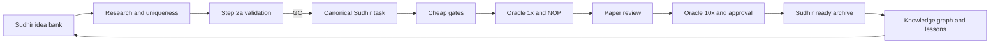

# TERMINUS Diamond Master Plan

## Mission

Turn this repository into a durable task-development system that becomes faster, safer, and more intelligent after every task. The repository must preserve decisions, research, command evidence, failures, reviews, reusable patterns, and task history while staying compatible with Terminal-Bench and Harbor.

## Non-negotiable outcomes

- One canonical source for each task and artifact.
- No repeated lifecycle prompt from the user.
- No task starts before category, uniqueness, feasibility, and Step 2a approval.
- No approval claim without current evidence.
- Every durable choice has an ADR.
- Every session leaves a resumable status and one next action.
- Knowledge accumulates as linked facts rather than disconnected notes.
- Submission archives are reproducible from canonical source.

## Operating architecture

## Folder contract

| Path | Responsibility |
| --- | --- |
| `sudhir_ideas/` | Idea records, uniqueness checks, and Step 2a evidence pointers |
| `sudhir_decisions/` | ADRs and decision index |
| `sudhir_research/` | Official sources, web/community findings, and source quality |
| `sudhir_tasks/active/` | Canonical editable task sources |
| `sudhir_tasks/archived/` | Rejected, superseded, or retired task sources |
| `sudhir_reviews/` | Per-task review findings and command-evidence summaries |
| `sudhir_tasks_ready_to_submit/` | Final validated zip archives only |
| `sudhir_logs/` | Append-only project activity log |
| `sudhir_knowledge/` | Reusable lifecycle and knowledge graph |
| `sudhir_plans/` | Master plan and scoped execution plans |
| `sudhir_progress/` | Current state, blockers, next action, future scope |
| `sudhir_templates/` | Submission text and evidence templates |

## Phase 0 - Preserve and baseline

Status: completed

1. Preserve current untracked tasks and archives before restructuring.
2. Record local and remote Git state.
3. Snapshot the current regression baseline.
4. Separate pre-existing failures from future task-caused failures.
5. Do not delete or move historical artifacts until indexed.

Known baseline blockers:

- fixture and schema paths are missing because broad ignore rules prevent tracking;
- the canonical regression suite is red;
- workflow document names and references disagree;
- milestone packaging rules disagree with the validator;
- local Python, Harbor, uv, Docker, and test dependencies drift from the manifest;
- existing user task artifacts are not consistently namespaced.

## Phase 1 - Governance and memory system

Status: active

1. Save the reusable lifecycle.
2. Add Cursor and agent skill adapters that load it automatically.
3. Create Sudhir-owned folders and indexes.
4. Create ADR policy and initial ADRs.
5. Create the progress tracker, changelog, research index, and knowledge graph.
6. Establish a no-duplicate-source rule.

Exit criteria:

- a new session can find the plan, status, decisions, and next action in under two minutes;
- saying `create a new Terminal-Bench task` automatically loads the lifecycle;
- every artifact has one documented owner path.

## Phase 2 - Gold harness repair

Status: completed

1. Repair ignore patterns so required schemas and regression fixtures can be tracked.
2. Restore or reconstruct the Step 2a validation schema and fixture baseline.
3. Resolve workflow naming and 1x versus 10x oracle contradictions.
4. Add milestone-aware zip validation or formally disable milestones.
5. Create a project-local locked toolchain.
6. Add a Sudhir path adapter so existing harness commands operate on `sudhir_tasks/active/<task>` and `sudhir_tasks_ready_to_submit/` without mutable duplication.
7. Make the canonical regression command green or document an accepted, hashed baseline through an ADR.

Exit criteria:

- clean environment bootstrap succeeds;
- regression command has an accepted green baseline;
- one fixture task completes preflight without path workarounds;
- all canonical paths are supported by tools.

Completion: the locked environment is green, all current archives validate,
milestone packages are supported, submission parity is hash-indexed, and a
temporary task under the canonical Sudhir path completed preflight successfully.

## Phase 3 - Robust Predicate Scale Parity, Step 2a

Status: completed

1. Confirm category `scientific-computing` from the taxonomy.
2. Confirm C, Rust, and Fortran each perform necessary work.
3. Research robust geometric predicates, floating-point contraction, FFI status semantics, and topology invariants.
4. Audit all existing task archives for semantic and naming collisions.
5. Draft a symptoms-only public contract.
6. Enumerate at least three hidden discoveries and three candidate distributed fix topologies.
7. Design a property-based verifier around exact determinant signs, Delaunay locality, affine invariance, inversion absence, and topology consistency.
8. Complete the Step 2a evidence and require GO before construction.

Exit criteria:

- Step 2a validator returns GO;
- the idea record, reviewer appendix, and ADR agree on category, scope, languages, and testable outcomes;
- authoring effort is bounded and no open research result is required.

Completion: attempt 1 recorded 0 FAIL and 0 WARN; the symptoms-only instruction,
four-discovery budget, three candidate topologies, four-location manifest,
12-test concentration plan, v2 authoring spec, and reviewer appendix all passed
mechanical validation. ADR-0006 approves the selected topology for construction.

## Phase 4 - Task construction

Status: completed

1. Create the approved task under `sudhir_tasks/active/robust-predicate-scale-parity/`.
2. Use a digest-pinned canonical GCC runtime and a digest-pinned canonical Rust builder when needed.
3. Build a meaningful 20-plus-file scientific system without filler.
4. Implement the broken environment, oracle, output contract, deterministic tests, and construction manifest.
5. Keep the public instruction symptoms-only and human sounding.
6. Log each meaningful design choice and divergence.

Exit criteria:

- static, Docker, collapse, and packaging-preview gates pass;
- oracle 1x scores 1.0;
- NOP scores 0.0;
- checksum and metrics state are current.

## Phase 5 - Review and hardening

Status: completed

1. Review every task surface against all listed writing, reviewer, instruction, CI, difficulty, and submission rules.
2. Validate every test permits multiple correct implementations.
3. Run partial-fix and location-reversion checks where appropriate.
4. Repair findings with minimal edits and rerun invalidated gates.
5. Record new failure patterns in the knowledge graph and CNI process.

Exit criteria:

- no Hard FAIL remains;
- every warning has a written disposition;
- Step 2b evidence is re-confirmed after the final edit;
- paper review is clean.

Completion: Step 3b removed verifier overconstraints and implementation policing,
added complete bundled-input coverage, proved a second valid implementation,
reconfirmed exact four-location ablations, and returned CLEAN with current-tree
oracle 1.0 and NOP 0.0.

## Phase 6 - Final package and submission copy

Status: completed

1. Run oracle 10x and require 10 of 10 at 1.0.
2. Run NOP and require 0.0.
3. Remove accidental or legacy canary strings, subject to a recorded upstream-policy conflict check.
4. Recheck canonical image digests.
5. Generate the archive in `sudhir_tasks_ready_to_submit/`.
6. Run zip validation, source parity, and approval.
7. Emit the UI rubric and three requested explanations in chat only.
8. Index the final archive, evidence, decisions, and lessons.

Exit criteria:

- all final commands exit 0;
- archive listing is manually inspected;
- no forbidden file or hidden answer is present;
- paste-ready submission text is supported by the actual solution and tests.

Completion: revision-4 oracle stress passed 10/10 at full concurrency, fresh
NOP scored 0.0, the 42-member archive passed validation and source parity, and
the approval gate returned approved true with no warnings or blockers. Final
submission copy is emitted in chat only.

## Phase 7 - Continuous intelligence

Status: continuous

After every task:

1. Promote recurring failures into rules or tools after sufficient evidence.
2. Demote obsolete or noisy rules.
3. Update idea-saturation maps and rejection history.
4. Track authoring time by phase and gate-retry counts.
5. Record which mathematical invariants produced the best verifier signal.
6. Compare task outcomes against frontier-agent evaluations.
7. Improve templates and automation without weakening independent review.

## Success metrics

- Time from approved idea to first green preflight.
- Number of first-pass gate successes.
- Number of edits after oracle 1x.
- Oracle 10x determinism rate.
- NOP rejection rate.
- Regression failures introduced per task.
- Duplicate-idea rejection rate before construction.
- Percentage of decisions represented by ADRs.
- Percentage of task lessons linked into the knowledge graph.
- Time for a new session to resume from the current status.

## Change policy

This plan is living. Update scope and status as evidence changes, but do not erase history. Material changes require an ADR and a changelog entry. When a plan section is replaced, state what superseded it and why.
